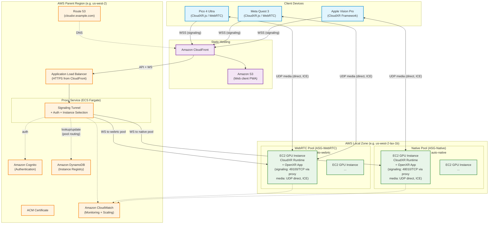

# CloudXR 6 on AWS — A Reference Architecture - Design Document

---

## Before Getting Started: A Note on the Two Key Considerations for CloudXR on AWS

Anyone evaluating NVIDIA CloudXR 6 on AWS will face two primary considerations: **latency** and **cost**. Understanding the tradeoffs involved upfront will help you design a deployment that fits your specific use case.

### Motion-to-Photon Latency

The defining metric for any cloud-streamed VR/AR experience is **pose-to-photon latency** — the time from when the user moves their head to when the corresponding frame appears in the headset. NVIDIA targets 20-30 ms for an imperceptible experience, with 100 ms as the maximum before the experience degrades significantly.

Two factors dominate this metric for CloudXR deployed on AWS:

1. **Instance location** — How physically close is the GPU instance to the XR device? Network round-trip time is the largest variable. Deploying in an [AWS Local Zone](https://aws.amazon.com/about-aws/global-infrastructure/localzones/) near the end user provides single-digit millisecond network latency. Deploying in a parent AWS Region can add 10-50+ ms depending on distance.

2. **GPU type** — NVIDIA recommends specific GPUs (RTX PRO 6000 Blackwell on g7e, L40S on g6e) that have fast NVENC encoders capable of encoding stereo 4K at 90fps in real time. Older GPUs (T4 on g4dn, A10G on g5) have slower encoders that add encoding latency, requiring stream resolution and frame rate reductions to compensate.

| Some Deployment Scenarios | Typical Pose-to-Render | User Experience |
|--------------------|-----------------------|-----------------|
| g7e in Local Zone (same metro) | ~35-40 ms | Slight lag on fast head movement; good for most use cases |
| g6e in Region (not nearby) | ~70 ms | Noticeable lag; acceptable for slower-paced experiences |
| g4dn/g5 in Local Zone (w/ downgraded stream settings) | ~60 ms | Noticeable lag; encoder-limited rather than network-limited |
| g4dn/g5 in Region (not nearby) | ~90+ ms | Near NVIDIA's maximum; only suitable for limited use cases |

Note: Being physically close to an AWS Region can have similar round-trip network latency advantages to AWS Local Zones - something to consider.

In an ideal deployment, NVIDIA-recommended GPU types (g7e or g6e) are deployed in an AWS Local Zone near end users. This is what this reference architecture showcases — the setup that delivers the best possible latency within AWS.

### Cost

GPU instances are not inexpensive, and costs directly correlate with GPU power:

| Example Instances | GPU | On-Demand $/hr (Windows, us-west-2, as of publishing) | GPU Encoder Limitation |
|----------|-----|---------------|------------------------|
| g7e.2xlarge | RTX PRO 6000 (Blackwell) | ~$3.73 | No |
| g6e.xlarge | L40S (Ada) | ~$2.05 | No |
| g5.2xlarge | A10G (Ampere) | ~$1.58 | Yes |
| g4dn.2xlarge | T4 (Turing) | ~$1.12 | Yes |

These are Windows rates, since the CloudXR Runtime requires a Windows server for audio streaming and this architecture's AMI is Windows Server 2022. Linux rates are lower. Note also that price scales with instance size within a family even when GPU count does not.

The right choice depends on your application's latency sensitivity, user expectations, and budget. A training simulation viewed at a slow pace may be perfectly acceptable at 70-90 ms on a $2.05/hr g6e in a Region. A fast-paced gaming or telepresence application may require a g7e in a Local Zone. Even the size of your instance(s) will depend on your application's CPU/memory needs.

### This Architecture's Approach

This reference architecture focuses on the **ideal deployment**: NVIDIA-recommended GPU instances (g7e/g6e) deployed in AWS Local Zones for ultra-low latency.

A dedicated section later in this document covers **alternative GPU types** (g4dn, g5) that are not officially recommended by NVIDIA but have been tested and confirmed functional — including the streaming concessions required and their latency implications. This architecture also works when deployed in a Region instead of a Local Zone, with potentially higher latency as the tradeoff.

You are welcome to adjust your deployment based on budget, instance availability, and your application's latency tolerance. For the latest Local Zone instance availability, refer to [this page](https://aws.amazon.com/about-aws/global-infrastructure/localzones/features/?nc=sn&loc=2). If you require a specific instance type/size in a Local Zone that isn't currently available, contact your AWS Account Manager, Solutions Architect, or Technical Account Manager to submit a capacity request.

---

## Architecture Diagram



## Diagram Legend

| Line Style | Meaning |
|-----------|---------|
| Solid arrow (→) | Signaling path (WSS/WS over TCP) — persistent for session lifetime |
| Double arrow (↔) | Media path (UDP) — direct between client and GPU instance, bypasses proxy |
| Dashed arrow (-.→) | Supporting services (auth, registry, monitoring) |

## Design Principles

1. **Follow [NVIDIA's cloud deployment model](https://docs.nvidia.com/cloudxr-sdk/release/6/integration/cloud_deployment.html)**: The proxy is a transparent TCP tunnel that forwards client WebSocket connections to GPU instances. Clients connect to a single CloudFront endpoint — the proxy handles instance selection and tunnels signaling, while the media path is negotiated directly between client and instance. (Note: NVIDIA's cloud deployment docs describe the proxy as "forwarding the WebSocket connection to the selected server instance by opening a new WebSocket connection to it and bidirectionally relaying all messages." In practice, this is implemented as a transport-level TCP tunnel — raw bytes piped bidirectionally after the HTTP upgrade handshake — which preserves the connection identity that CloudXR Runtime's signaling protocol requires.)
2. **Performance is the top priority**: GPU compute placed in AWS Local Zones for single-digit millisecond latency to end users (~35-40ms pose-to-render with g7e). Deploying in a parent Region is a viable fallback with higher latency (~70ms). Proxy, auth, registry, and monitoring run in the parent region (latency-tolerant — not in the streaming path).
3. **Support all CloudXR 6 client paths**: Apple native (CloudXR Framework) and Web (CloudXR.js) through a single proxy entry point. Two GPU pools: native pool (`auto-native`, port 48010) for Apple devices, WebRTC pool (`auto-webrtc`, port 49100) for Quest/Pico/browsers. Proxy determines client type and routes accordingly.
4. **One streaming session per GPU instance**: Scaling = adding instances.
5. **Direct UDP media via ICE + STUN**: After signaling, media flows directly between client and instance over UDP — never through the proxy. This follows the media establishment approach in [NVIDIA's cloud deployment guide](https://docs.nvidia.com/cloudxr-sdk/release/6/integration/cloud_deployment.html): each instance runs with ICE enabled and is configured with a STUN server, which the runtime uses to discover its public-facing media candidate. Client and instance exchange ICE candidates over the proxied signaling channel, then negotiate the media path between themselves.
6. **CloudFront is the single entry point**: All client traffic (static content, API, WebSocket) flows through CloudFront. Static files are served from S3 via edge cache. API and WebSocket requests are forwarded to the ALB. This provides DDoS protection (Shield), WAF integration, and global TLS termination.

    This includes Apple native clients, but they need one thing stated explicitly. CloudXR Framework defaults its secure-signaling port to 48322 (probing 322 first), and CloudFront serves viewer traffic only on 80/443, so a bare hostname produces a connection timeout against a CloudFront edge. `.remoteSecure` accepts a `host:port` value and honours the port, so native clients pass `<domain>:443` and traverse the edge like everything else. That behaviour is undocumented by NVIDIA as of 6.2.x — confirmed by their engineering team and verified by test. Omitting the port is the single most likely native misconfiguration; see [avp-client-guide.md](../deployment/avp-client-guide.md).

---

## Components

### 1. Client Devices

| Device | SDK | Signaling Endpoint | Media Protocol |
|--------|-----|-------------------|----------------|
| Apple Vision Pro | CloudXR Framework (Swift) | WSS via proxy (`<domain>:443`) | Native UDP (direct to instance) |
| iPhone / iPad | CloudXR Framework (Swift) | WSS via proxy (`<domain>:443`) | Native UDP (direct to instance) |
| Meta Quest 2/3/3S | CloudXR.js (WebRTC) | WSS via proxy | WebRTC UDP (direct to instance) |
| Pico 4 Ultra | CloudXR.js (WebRTC) | WSS via proxy | WebRTC UDP (direct to instance) |
| Desktop browsers | CloudXR.js (WebRTC) | WSS via proxy | WebRTC UDP (direct to instance) |

All clients connect to the same proxy endpoint using `remoteSecure` (native) or `useSecureConnection: true` (web). Both must present a Cognito JWT on the signaling upgrade, and native clients must also set `x-cloudxr-device-type: native` to reach the native pool.

Native clients additionally have to state the port explicitly as `<domain>:443`, because the framework would otherwise default to 48322 — see [Design Principle 6](#design-principles). Web clients set their signaling URL directly and need no equivalent.

---

### 2. Proxy Layer (AWS Parent Region)

**Purpose**: Authenticates clients, selects available GPU instances, and tunnels WebSocket signaling connections. Sits behind CloudFront (which is the public-facing entry point).

**AWS Services**:

| Service | Role |
|---------|------|
| **Route 53** | DNS alias pointing the domain to CloudFront, plus an `origin.<domain>` alias to the ALB that exists solely so CloudFront can reach its origin by a certificate-matching name — clients never address it |
| **AWS Certificate Manager (ACM)** | Two CA-signed TLS certificates: one in us-east-1 for CloudFront's viewer connections, and one in the deployment region for the ALB's HTTPS listener (valid for `origin.<domain>`) |
| **Application Load Balancer (ALB)** | HTTPS-only routing from CloudFront to the proxy containers. Internet-facing by necessity (a CloudFront custom origin must be publicly resolvable), but it has no plaintext listener and its security group admits only CloudFront's `com.amazonaws.global.cloudfront.origin-facing` prefix list, so it cannot be reached directly |
| **Amazon ECS (Fargate)** | Runs the proxy service containers (signaling tunnel + session allocation API) |
| **Amazon Cognito** | Client authentication. The proxy validates a Cognito JWT on **both** the session API and the WebSocket signaling upgrade — see [Authentication](#authentication) below |
| **Amazon DynamoDB** | Instance registry — tracks which GPU instances are available vs. occupied |

**How it works**:
1. Client authenticates against Cognito (obtains JWT token)
2. Client requests a session from the proxy (`POST /api/session` with JWT). Proxy validates the token, confirms an instance is available in the registry, and returns the signaling URL. (The response also carries the instance ID for display and diagnostics; the binding instance is selected when the signaling connection is made — see step 6.)

    This step is a **pre-flight capacity check, not a prerequisite for binding**. A client that skips it and goes straight to the signaling upgrade still connects correctly, because the proxy re-scans the registry and selects an instance at upgrade time. Calling it first is worthwhile for user experience — it surfaces a `no_capacity` error before a socket is opened — and the bundled web client does. The reference native client in [avp-client-guide.md](../deployment/avp-client-guide.md) omits it.
3. Client creates a CloudXR session configured with the proxy as the signaling server and a secure connection (`useSecureConnection: true` for web, `.remoteSecure` for native). No media address is supplied — the media path is negotiated via ICE.
4. Client opens WSS to CloudFront, which terminates the viewer TLS session and re-encrypts to the ALB over HTTPS. The signaling resource path differs by client type: web (WebRTC) clients connect to `wss://cloudxr.example.com/<resource-path>/sign_in?...`, while native CloudXR Framework clients use a fixed `/rtsp` path. Each has its own CloudFront cache behavior pointing at the ALB — without one the upgrade falls through to the S3 default behavior and is answered with a 403. Native clients must also address the host as `cloudxr.example.com:443` so the framework does not fall back to 48322 (see Design Principle 6)
5. ALB routes the WebSocket upgrade to a Fargate proxy container
6. Proxy selects an available instance from the DynamoDB registry for the client's pool and marks it `occupied`, then opens a raw TCP connection to that instance's private IP (within VPC) on the appropriate port (48010 for native, 49100 for WebRTC), forwards the HTTP upgrade handshake, and establishes a transparent TCP tunnel
7. All signaling traffic flows bidirectionally through this tunnel for the session's lifetime — the proxy does not parse or modify WebSocket frames (transport-level transparency is required by CloudXR Runtime's signaling protocol)
8. When either side disconnects, proxy closes the other connection and marks the instance as available in DynamoDB

**Key points**:
- GPU instances do NOT need public signaling ports — the proxy connects to them over the private VPC network
- Fargate containers are stateless except for the active TCP tunnel — horizontal scaling is straightforward

#### Authentication

Both proxy entry points require a valid Cognito JWT, and both must, because they are independently reachable:

| Entry point | Credential | Enforced in |
|---|---|---|
| `POST /api/session` | JWT in the request body | `verifyToken()` on the request |
| WebSocket upgrade (`/sign_in` for web, `/rtsp` for native) | JWT from `Authorization: Bearer`, a `token` query parameter, or the `cxr_token` cookie | `verifyToken()` before any instance is allocated |

Three credential sources exist because the client paths differ. Native clients set `signalingHeaders: ["Authorization": "Bearer <jwt>"]`. Web clients can pass `signalingQueryParameters` (CloudXR.js appends it to the signaling URL); the bundled login page instead sets a same-origin `cxr_token` cookie after authenticating, which the browser sends automatically on the WSS upgrade — the CloudXR.js client opens that socket itself, so a header cannot be attached to it. CloudFront's `AllViewer` origin request policy forwards headers, cookies, and query strings to the ALB. The proxy strips the `token` parameter before forwarding, so the CloudXR Runtime never sees it.

Gating the upgrade matters independently of the session API: `/api/session` is an advisory capacity check that does not bind an instance, so an unauthenticated upgrade would be allocated a GPU regardless of whether the session API was ever called.

**Encryption in transit, end to end.** Viewer → CloudFront is HTTPS (`redirect-to-https`, TLSv1.2_2021 minimum). CloudFront → ALB is also HTTPS (`https-only`, TLSv1.2): that hop crosses the public internet and carries the JWT, so a plaintext origin would expose the credential the authentication above depends on. Because CloudFront validates the origin certificate against the hostname it connects to, the stack publishes a `origin.<domain>` Route 53 alias to the ALB and CloudFront targets that name — an ALB's own `*.elb.amazonaws.com` name could never match a certificate issued for your domain. ALB → Fargate is plain HTTP on 8080, which stays inside the VPC.

**Network-level restriction:** the ALB security group admits only CloudFront's origin-facing prefix list, on 443 only. Without that, the internet-facing ALB would be reachable directly, bypassing CloudFront entirely.

**Scope:** one stack per region. Resource names are fixed rather than stack-prefixed, so a second concurrent stack in the same region will fail on name conflicts — use a different region for a second environment.

---

### 3. GPU Compute Layer (AWS Local Zone)

**Purpose**: Run the OpenXR application + CloudXR Runtime. Encode and stream XR content directly to clients over UDP.

**AWS Services**:

| Service | Role |
|---------|------|
| **EC2 G7e / G6e instances** | GPU compute (NVIDIA RTX PRO 6000 Blackwell / L40S Ada) |
| **Auto Scaling Groups (2 ASGs)** | Separate pools for native and WebRTC clients |
| **Public IPs (auto-assigned)** | Each instance gets a public IP via subnet auto-assign for direct UDP media streams to clients |
| **Security Groups** | Allow UDP media ports from 0.0.0.0/0; allow TCP signaling only from proxy (VPC internal) |

**Two instance pools** (required because `device-profile` is set at runtime startup and cannot change mid-session):

| Pool | ASG | device-profile | Signaling Port | Clients Served |
|------|-----|---------------|----------------|----------------|
| **Native Pool** | ASG-Native | `auto-native` | TCP 48010 | Apple Vision Pro, iPhone, iPad |
| **WebRTC Pool** | ASG-WebRTC | `auto-webrtc` | TCP 49100 | Meta Quest, Pico, desktop browsers |

The Fargate proxy selects the pool from the `x-cloudxr-device-type` request header on the WebSocket upgrade: `native` routes to the native pool on 48010, and anything else (including an absent header) routes to the WebRTC pool on 49100. Native clients must set that header explicitly — the `deviceType` field on `POST /api/session` only influences the advisory capacity check, not the binding.

**Instance configuration (both pools)**:
- OS: Windows Server 2022 (required for LÖVR sample; Ubuntu 22.04 supported for custom Linux OpenXR apps)
- GPU driver: NVIDIA GRID (latest from `ec2-windows-nvidia-drivers` S3 bucket; for Windows Server). Data center driver with graphics mode for Linux.
- CloudXR Runtime 6.2.1
- **OpenXR runtime registry (Windows Server only):** The OpenXR loader ignores the `XR_RUNTIME_JSON` environment variable when running as Administrator. On Windows Server, register the runtime via registry:
  ```
  reg add "HKLM\SOFTWARE\Khronos\OpenXR\1" /v ActiveRuntime /t REG_SZ /d "<path-to-openxr_cloudxr.json>" /f
  ```
  Without this, the streaming service connects but the OpenXR application cannot render — resulting in a black screen.
- **Auto-logon (Windows Server only):** CloudXR Runtime requires an interactive desktop session (Session 1) for Direct3D/GPU access. Configure Windows auto-logon to ensure an interactive session exists at boot.
- **Headless mode:** The LÖVR sample (v1.2.0) supports a `--headless` flag that skips the desktop preview window — useful on cloud GPU instances with no display. Frames still render and stream to clients; only the host window is omitted.
- **Startup mechanism:** Use a scheduled task as the primary launch mechanism (the Windows Startup folder may not execute on first boot due to session timing).
- Runtime properties set before startup (via the Runtime Management API):
  - `enable-ice`: set to `true`. Set this explicitly — the default is `true` only when `device-profile` is `auto-webrtc`; for `auto-native` it defaults to `false`.
  - `stun-server-ip` / `stun-server-port`: the STUN endpoint ICE uses to discover the instance's public-facing media candidate. This architecture uses the public endpoint `stun.l.google.com:19302`. (NVIDIA documents `stun-server-ip` as an IP address; a resolvable hostname also works. Use a literal IP if you prefer to avoid depending on DNS resolution inside the runtime.)
  - `endpoint-ip` and `media-port` are left at their defaults (bind all interfaces; auto-assign the media port) — ICE negotiates the media path.
- One OpenXR application per instance (LÖVR, Unreal Engine, Omniverse Kit, or custom)
- One streaming session per instance

**Media path — ICE + STUN:**

Media is established using ICE, per [NVIDIA's cloud deployment guide](https://docs.nvidia.com/cloudxr-sdk/release/6/integration/cloud_deployment.html). The runtime has ICE enabled and a STUN server configured, which it uses to discover its public-facing media candidate. Client and instance exchange ICE candidates over the proxied signaling channel, then send media directly to each other over UDP — bypassing the proxy entirely.

No media address or port is pre-communicated to the client; the negotiation determines the path.

> **Note:** Instances use auto-assigned public IPs from the subnet (`MapPublicIpOnLaunch: true`) rather than Elastic IPs. This simplifies the architecture (no EIP quota limits, no allocation/release lifecycle) and needs no special handling, since ICE discovers the instance's current public mapping via STUN at session time. If stable IPs are required (e.g., for IP allowlisting), Elastic IPs can be used instead with appropriate quota increases.

---

### 4. Static Assets & Web Client Hosting

**Purpose**: Serve the CloudXR.js web client to browsers over HTTPS with global CDN caching. CloudFront also routes API and WebSocket traffic to the ALB.

**AWS Services**:

| Service | Role |
|---------|------|
| **Amazon CloudFront** | Single public entry point — serves static content from S3, routes API/WebSocket to ALB |
| **Amazon S3** | Stores the built web client (HTML/JS/CSS) |
| **Route 53** | DNS alias pointing the domain to the CloudFront distribution |

**CloudFront routing**:

| Path Pattern | Origin | Purpose |
|---|---|---|
| `/api/*` | ALB | Session allocation API |
| `/sign_in*` | ALB | WebSocket signaling — web/WebRTC (direct path) |
| `/*/sign_in*` | ALB | WebSocket signaling — web/WebRTC (with signalingResourcePath prefix) |
| `/rtsp*` | ALB | WebSocket signaling — native CloudXR Framework clients |
| `/health` | ALB | Proxy health check |
| Default (`*`) | S3 | Static web client files |

**Note**: CloudFront supports WebSocket protocol upgrades when the origin request policy forwards the required headers (`Sec-WebSocket-Key`, `Sec-WebSocket-Version`, `Upgrade`, `Connection`). The `AllViewer` managed policy handles this.

**Every signaling path needs an explicit behavior.** The default behavior points at S3, and S3 answers `403 AccessDenied` for any key it does not hold, so a signaling path with no matching behavior fails as an authorization error rather than a routing one. Native clients surface it as `NVST_SIGERR_FORBIDDEN (0x80420001)` with nothing in the proxy log, because the request never reaches the proxy. Web and native use different paths (`/sign_in*` vs `/rtsp*`), so a working web client is not evidence that the native path is routed.

---

### 5. Monitoring & Operations

| Service | Role |
|---------|------|
| **Amazon CloudWatch** | Metrics, alarms, ASG scaling triggers |
| **AWS Systems Manager (SSM)** | Remote access to GPU instances (no SSH/RDP ports needed) |
| **CloudWatch Logs** | Proxy container logs (`/ecs/cloudxr-proxy`). GPU instances log locally to `C:\cxr-logs` and are read over SSM — shipping those to CloudWatch would need an agent, which this architecture does not install |

---

## Port Summary

### GPU Instance Security Group

| Port | Protocol | Source | Purpose |
|------|----------|--------|---------|
| 48010 | TCP | Proxy SG (VPC) | Native signaling, proxy to GPU. Plaintext WebSocket is fine on this hop because it stays inside the VPC. NVIDIA's 48322 (secure signaling) is not used anywhere in this architecture — clients reach the proxy over 443 through CloudFront, and this hop needs no TLS. |
| 49100 | TCP | Proxy SG (VPC) | WebRTC signaling (from proxy) |
| 47998-48012 | UDP | 0.0.0.0/0 | Media streams — direct from clients. ICE negotiates the specific port within CloudXR's media range (video, input, audio). |

**Outbound:** The runtime needs outbound UDP to the configured STUN endpoint (port `19302` for `stun.l.google.com`) to discover its public media candidate. Default security group egress permits this.

### ALB Security Group

| Port | Protocol | Source | Purpose |
|------|----------|--------|---------|
| 443 | TCP | CloudFront `origin-facing` prefix list | HTTPS from CloudFront to the `origin.<domain>` alias. No plaintext listener exists, and the prefix list prevents direct access. This is the only ingress — every client path, native included, arrives through CloudFront |

Note for operators: this rule uses a prefix list, which consumes 55 entries against the default quota of 60 rules per security group, leaving little headroom. Adding a second prefix-list rule will fail with `RulesPerSecurityGroupLimitExceeded` — request a quota increase first.

---

## A Note Related To Recommended GPU Instances

| Instance | GPU | VRAM | Generation |
|----------|-----|------|------------|
| **G7e** (preferred) | NVIDIA RTX PRO 6000 | 96 GB | Blackwell |
| **G6e** | NVIDIA L40S | 48 GB | Ada Lovelace |

**GPU clock management (G7e only):** The Blackwell GPU has aggressive power management that may not boost clocks for lightweight render workloads. For test/demo applications, lock GPU clocks with `nvidia-smi -lgc 2000,2520`. This does not persist across reboots and should be included in the instance startup script. Not needed for g6e or for production workloads that drive high GPU utilization.

**Local Zone availability:** GPU instance availability in Local Zones varies by location and is subject to AWS capacity, which AWS regularly updates. Check availability using `aws ec2 describe-instance-type-offerings` with the `--location-type availability-zone` filter for your target Local Zone. When the preferred instance type is not available in a Local Zone near you, consider deploying in the closest parent Region as a fallback — or see the section on alternative GPU types below.

---

## Alternative GPU Types (Not Officially Supported by NVIDIA)

NVIDIA's official supported list specifies L40S/Ada and newer (g6e/g7e). However, older GPU types have been tested and confirmed functional with the CloudXR Runtime — their NVENC encoders are compatible. These are relevant because:

- **g4dn (T4) and g5 (A10G) are widely available in AWS Local Zones**
- **They generally cost less** than the recommended instances
- **They work** — but with concessions

### What Works

CloudXR Runtime starts, accepts connections, streams frames, and delivers a functional VR experience on both T4 (g4dn) and A10G (g5).

### The Concession

These GPUs cannot encode the full packed frame (4096x4032) at 90fps without dropping frames. Their older NVENC encoders are too slow for the default packed stereo stream at full frame rate. This manifests as encoding backpressure that adds latency to every frame.

Two different quantities appear in this document and they are easy to conflate. **4096x4032 is the packed surface NVENC encodes** — one frame containing both eyes. **2048 × 1792 is the per-eye content resolution** configured on the client, and it is the CloudXR default. The width reconciles as a simple pair (2048 × 2 = 4096); the height does not (1792 × 2 = 3584, not 4032), so the packed layout is evidently not a plain side-by-side or stacked arrangement of two eye buffers. NVIDIA does not publish the packing scheme, so this document deliberately reports both measured figures without asserting a formula relating them.

### Optimized Settings for g4dn / g5

To achieve usable performance, consider reducing the encoder workload via client-side settings, for example something like this below:

| Setting | Default (g7e/g6e) | Optimized (g4dn/g5) |
|---------|-------------------|---------------------|
| Per-Eye Resolution | 2048 × 1792 | 1792 × 1792 |
| Video Codec | AV1 | H.264 |
| Device Frame Rate | 90 FPS | 72 FPS |

With these settings, pose-to-render of ~55-65 ms is achievable in a Local Zone — usable for many applications but short of the <40 ms that g7e delivers.

### When to Use Alternative GPU Types

- Your target Local Zone only has g4dn/g5 available
- Your application is latency-tolerant (architectural visualization, training, slow-paced experiences)
- Budget is a primary constraint
- You need broad geographic coverage across many Local Zones

### When NOT to Use Alternative GPU Types

- Your application requires <50 ms pose-to-render (fast-paced gaming, telepresence)
- You need full 90fps at maximum resolution
- NVIDIA support is required (they will not troubleshoot issues on unsupported GPUs)

---

## Known Limitations

1. **Clients behind symmetric NAT or strict corporate firewalls may not be able to connect.** ICE with STUN handles the common NAT cases, but symmetric NAT (found in some corporate environments) assigns a different external port per destination, so the mapping STUN discovers does not apply to the media peer. Networks that block the negotiated UDP media traffic outright have the same effect. The standard remedy is a TURN relay, which this architecture does not deploy — see [Production Considerations](#production-considerations-not-implemented-by-this-architecture). This affects an estimated ~20% of corporate network users.

2. **IPv6 is not supported by the CloudXR Runtime** (a documented [known limitation](https://docs.nvidia.com/cloudxr-sdk/release/6/release_notes/release_notes.html); IPv4 is required). On dual-stack client networks, the runtime logs may show IPv6 address parsing warnings during ICE candidate exchange. These are non-consequential — ICE completes on an IPv4 candidate pair and streaming proceeds normally.

3. **Audio streaming is Windows-only.** CloudXR Runtime supports downstream audio streaming on Windows servers only (Linux audio support is planned). Upstream microphone audio from clients requires the CloudXR Virtual Audio Driver to be installed on the Windows server (included in the CloudXR Runtime SDK).

---

## Production Considerations (NOT implemented by this architecture)

This reference architecture covers the core CloudXR 6 streaming design on AWS. For a production deployment, the following additional concerns should be addressed:

### Session & Instance Lifecycle

- **Warm pools / pre-provisioning:** GPU instances have cold start times of 2-5 minutes (boot + driver init + app load). For instant session availability, use ASG warm pools or maintain a minimum fleet of pre-configured instances ready to accept connections.
- **Session timeouts:** Implement heartbeat monitoring in the proxy to detect stale sessions (client crashes, network drops). Auto-release instances back to the available pool after a configurable timeout.
- **Health checks:** Instances should self-report readiness to DynamoDB (CloudXR Runtime started, ports listening, GPU healthy). The proxy should only route to instances that pass health checks.

### Scaling & Cost Optimization

- **Auto-scaling policies:** Define scale-out triggers (e.g., >80% of instances occupied) and scale-in policies (e.g., idle instances after 15 min with no session). GPU instances are expensive — scale-in aggressively when demand drops.
- **Spot instances:** For non-latency-critical workloads (demos, dev/test), Spot instances can reduce GPU costs by 60-70%. Not recommended for production sessions where interruption would disconnect users.
- **Time-based scaling:** If usage patterns are predictable (e.g., business hours only), schedule ASG capacity changes to avoid paying for idle GPU instances overnight.

### Multi-Region / Multi-Local Zone

- **Geographic routing:** For global deployments, deploy GPU pools in multiple Local Zones and use Route 53 latency-based routing to direct clients to their nearest proxy. The proxy then selects an instance from the local pool.
- **Cross-region proxy coordination:** If a local pool is fully occupied, the proxy can fall back to instances in other Local Zones or the parent region (with higher latency) rather than rejecting the session.

### Networking

- **Run your own STUN infrastructure:** This architecture points the runtime at a public STUN endpoint (`stun.l.google.com:19302`), which keeps the reference deployment dependency-free. Public STUN endpoints carry no availability or performance guarantee. For production, run your own STUN server (e.g. [coturn](https://github.com/coturn/coturn)) or use a managed provider, and set `stun-server-ip` / `stun-server-port` accordingly. `stun-username` and `stun-credential` are available for authenticated STUN.
- **TURN relay for restrictive networks:** Clients behind symmetric NAT — or on networks that block the negotiated UDP media — cannot establish a direct media path (see Known Limitations). Deploying a TURN relay gives ICE a relayed candidate to fall back on. CloudXR.js accepts both STUN and TURN servers via the `iceServers` option on `createSession()`.

### Application Deployment

- **Golden AMI strategy:** Bake the GPU driver, CloudXR Runtime, OpenXR registry fix, and your XR application into a custom AMI. This takes driver installation and application build time off the critical path — but boot, driver initialisation and runtime startup still take several minutes (measured ~5-7 minutes to streaming-ready on a `g7e.8xlarge`). Warm pools, not the AMI alone, are what deliver instant availability.
- **Container-based deployment:** For more flexibility, package the XR application in a container that runs on a pre-configured base AMI with the GPU driver and CloudXR Runtime. Enables versioned deployments and rollbacks. The LÖVR sample (v1.2.0) ships with Docker support, which is a useful starting point for this pattern.
- **Asset delivery:** For large XR scenes, pre-stage assets on the AMI or pull from S3 at boot. Avoid downloading large assets on every instance launch.

### Security

- **VPC endpoints:** Use VPC endpoints for DynamoDB, S3, and CloudWatch to keep AWS API traffic off the public internet.
- **WAF on CloudFront:** Protect the endpoint from DDoS and abuse with AWS WAF rate limiting at the edge.
- **Secrets management:** Store credentials (Cognito secrets, DynamoDB keys) in AWS Secrets Manager, not environment variables or instance metadata.
- **Instance auto-logon credentials:** This reference architecture bakes a static Administrator password into the AMI for auto-logon (required for CloudXR's interactive session). For production, retrieve a per-instance password from Secrets Manager at boot, configure auto-logon dynamically, and ensure RDP (port 3389) is never exposed in security groups (use SSM for access).
- **Audit logging:** Enable CloudTrail for API activity and VPC Flow Logs for network forensics.

### Observability

- **Key metrics to track:** Active sessions, session duration, GPU utilization (render + encode), NVENC queue depth, pose-to-frame latency, streaming FPS, packet loss/jitter per session, instance pool utilization (available vs. occupied).
- **Alerting:** Set alarms on pool exhaustion (>90% occupied), session error rates, GPU thermal throttling, and streaming FPS drops below target.
- **Dashboards:** Build operational dashboards showing real-time session counts, latency distribution, and fleet health.

### CI/CD

- **Runtime updates:** When NVIDIA releases new CloudXR Runtime versions, rebuild the golden AMI and roll out via ASG instance refresh (rolling replacement).
- **XR application updates:** Deploy new app versions via AMI update or container push, with canary testing on a subset of instances before full rollout.
- **Web client updates:** Deploy new CloudXR.js builds to S3 + CloudFront with cache invalidation for instant global propagation.

### Future Enhancements

- **Upstream microphone audio:** With the CloudXR Virtual Audio Driver installed and `mic-streaming` enabled on the runtime, clients can stream microphone audio to the server application — enabling voice-interactive XR experiences.
