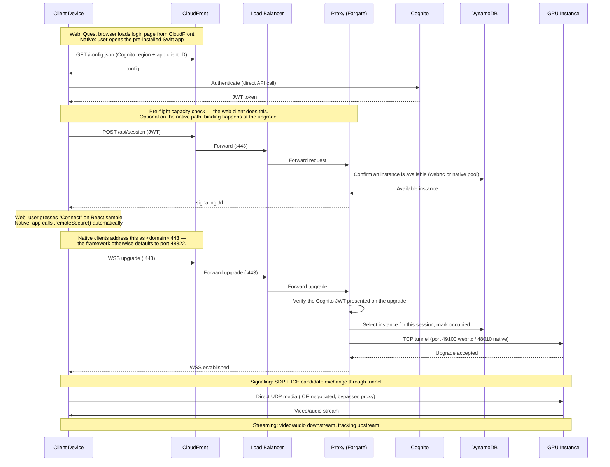

# CloudXR 6 on AWS — Full Architecture Deployment Guide

This guide deploys the complete [CloudXR 6 on AWS reference architecture](https://github.com/laroueaws/cloudxr-aws-reference-architecture/blob/main/architecture/architecture.md) as a working system: WebSocket proxy, client authentication, instance registry, GPU compute fleet, and all supporting networking and security.

**Target SDK versions:** CloudXR Runtime 6.2.1, CloudXR.js 6.2.0, LÖVR sample v1.2.0.

**Server OS:** Windows Server 2022.

**What you get:** A single HTTPS endpoint (`https://your-domain.com`) that authenticates XR clients, routes them to available GPU instances, and enables direct UDP media streaming — the full architecture described in our [design document](../architecture/architecture.md).

**By default,** this deploys the [NVIDIA LÖVR sample](https://github.com/NVIDIA/cloudxr-lovr-sample) (v1.2.0) as the XR application. Replace `ami/scripts/04-install-app.ps1` with your own OpenXR application's installation steps.

---

## End-to-End User Experience (for LÖVR sample)

### Quest 3 / WebRTC path

1. User opens Quest browser → navigates to `https://your-domain.com`
2. Sees a login screen → enters credentials → presses "Connect to VR"
3. After authentication, the client automatically:
   - Requests a streaming session from the proxy (`POST /api/session`)
   - Proxy validates auth, selects an available GPU instance, returns the signaling URL
   - Initializes the CloudXR.js SDK with the proxy URL
   - Connects via WSS to the proxy for signaling (proxy tunnels to GPU instance on port 49100)
   - Negotiates the media path via ICE, then streams media directly to/from the GPU instance over UDP
4. User presses "Connect" once more on the stock React sample CloudXR.js web app → sees the XR application rendered on the GPU instance

No instance IPs, media ports, or server addresses are entered manually.

📹 **[Quest 3 walkthrough](https://streamable.com/gxj0cs)** — screen recording captured on the headset itself, with narration: login, connect, and streaming the LÖVR sample.

### Apple Vision Pro / native path

1. User opens a native Swift app (built with CloudXR Framework)
2. App shows a login screen and the user enters a username and password
3. After sign-in, the app automatically:
   - Fetches `https://<domain>/config.json` to discover the Cognito region and app client ID, so nothing about the deployment is compiled into the app
   - Exchanges the credentials for a Cognito ID token (`InitiateAuth`), and stores the refresh token so later launches need no password
   - Configures a CloudXR session with `.remoteSecure(host: "your-domain.com:443", signalingHeaders: ["Authorization": "Bearer <token>", "x-cloudxr-device-type": "native"])`. The `:443` is required — CloudXR Framework otherwise defaults to port 48322, which CloudFront does not serve. `x-cloudxr-device-type: native` is what routes to the native pool; without it the proxy would pick the WebRTC pool
   - Connects via WSS through CloudFront for signaling, through the same entry point as the web path but on its own `/rtsp` resource path rather than `/sign_in*`. The proxy validates the token on the upgrade, selects an available native-pool GPU instance, and tunnels to it on port 48010
   - Negotiates the media path via ICE, then streams media directly to/from the GPU instance over UDP
4. User sees the XR application in their AVP

No instance IPs, media ports, or server addresses are entered manually — same as the web path.

This is exactly what the reference client in [avp-client-guide.md](avp-client-guide.md) does. Note it does **not** call `POST /api/session`: on the native path that endpoint is an optional pre-flight capacity check, and the instance binding happens when the proxy handles the signaling upgrade. A production client may still want to call it to fail fast with a clear "no capacity" message before opening a socket.

📹 **[Apple Vision Pro walkthrough](https://streamable.com/2o5bic)** — screen recording of the visionOS Simulator with narration: opening the viewer, signing in, connecting, streaming the LÖVR sample, and touring the HUD and Server Actions panels. Run in the simulator rather than on hardware; see [Validation status of the native path](#validation-status-of-the-native-path) for what that does and does not demonstrate.

> **Both recordings show the happy path.** On a freshly booted instance the first one or two connection attempts do not stream cleanly — see [Notes from Validation](#notes-from-validation) for what to expect and how to clear it.

**In both paths**, a user of this repo replaces the LÖVR sample on the server with their own OpenXR application, and builds their own client (PWA for web, native app for AVP). The proxy, auth, and routing infrastructure remain the same.

### Connection Sequence



---

## Your Deployment Configuration

Fill out `config.env` before running any commands. Both the AMI build and the infrastructure deployment read from this single file — you configure once, and everything stays consistent.

```bash
# AZ or Local Zone for GPU instances
GPU_ZONE=us-west-2-lax-1b
# Instance type (must be available in GPU_ZONE)
GPU_TYPE=g7e.8xlarge
# Proxy domain
DOMAIN=cloudxr.example.com
# Route 53 hosted zone ID
HOSTED_ZONE_ID=Z0123456789ABCDEFGHIJ
# ACM certificate for CloudFront (must be in us-east-1) — covers DOMAIN
CERT_ARN=arn:aws:acm:us-east-1:123456789012:certificate/xxxxxxxx-xxxx-xxxx-xxxx-xxxxxxxxxxxx
# ACM certificate in the DEPLOYMENT region, for the ALB's HTTPS listener.
# Must be valid for origin.<DOMAIN> — see Prerequisites.
CERT_ARN_REGIONAL=arn:aws:acm:us-west-2:123456789012:certificate/xxxxxxxx-xxxx-xxxx-xxxx-xxxxxxxxxxxx
# GPU fleet size
WEBRTC_POOL_SIZE=1
NATIVE_POOL_SIZE=0
# Golden AMI — defaults to the published g7e 1-GPU AMI for us-west-2, matching the
# GPU_ZONE and GPU_TYPE above. Another region needs that region's ID (see Step 1).
AMI_ID=ami-0a7bcd77b90558f9c
```

> Values may carry trailing `# comments` — both `deploy.sh` and `ami/build-ami.sh` strip them, along with surrounding whitespace. Quotes are not needed and are not stripped, so write `DOMAIN=cloudxr.example.com`, not `DOMAIN="cloudxr.example.com"`.

The parent region (e.g., `us-west-2`) is derived automatically from `GPU_ZONE`. All non-GPU resources (proxy, ALB, auth, registry) deploy in the parent region. GPU instances deploy in `GPU_ZONE`.

---

## Prerequisites

### On your deployment machine

Your laptop, workstation, or any machine you use to run these commands:

| # | Requirement | Install |
|---|---|---|
| 1 | AWS CLI v2 | [Install guide](https://docs.aws.amazon.com/cli/latest/userguide/getting-started-install.html) — configured with admin-level credentials |
| 2 | Bash shell, plus `perl` | macOS/Linux native, or WSL on Windows. `perl` is preinstalled on both and is used by `deploy.sh` to patch the harvested web client |
| 3 | This repository, cloned locally | Clone it, then `cd` into the `deployment/` directory — **every command in this guide is run from there**, since the paths are relative (`./deploy.sh`, `./ami/build-ami.sh`) |

### In your AWS account

| # | Requirement | How |
|---|---|---|
| 4 | Route 53 hosted zone | Must exist for your domain before deployment |
| 5 | ACM certificate for CloudFront | Request and validate for your domain **in us-east-1** (CloudFront requires certs in us-east-1) |
| 6 | ACM certificate for the ALB | A **second** certificate in your **deployment region**, valid for `origin.<your-domain>`. Both are free. See the note below for why two are needed |
| 7 | Local Zone opted-in | Only if `GPU_ZONE` is a Local Zone |
| 8 | Instance availability | Confirm `GPU_TYPE` is available in `GPU_ZONE` |
| 9 | Sufficient quota | GPU instance quota in the derived region |
| 10 | Default VPC in the region | Only needed for Step 1 (building your own AMI). Verify with `aws ec2 describe-vpcs --filters "Name=isDefault,Values=true" --region <region>`. Step 2 creates its own VPC and does not need this |

Nothing else needs to pre-exist. Step 1 creates its own build infrastructure and Step 2 creates the full stack — VPC, subnets, ALB, ECS, Cognito, DynamoDB, S3, and CloudFront — from scratch.

**Opt-in to Local Zone** (if applicable):
```bash
aws ec2 modify-availability-zone-group \
  --group-name us-west-2-lax-1 \
  --opt-in-status opted-in \
  --region us-west-2
```

**Check instance availability:**
```bash
aws ec2 describe-instance-type-offerings \
  --location-type availability-zone \
  --filters "Name=instance-type,Values=g7e.8xlarge" \
  --region us-west-2 \
  --query 'InstanceTypeOfferings[?Location==`us-west-2-lax-1b`]' \
  --output table
```

**Optional — verify actual capacity.** Skip this on a first run: it needs an existing subnet in your target zone, which you will not have until Step 1 or Step 2 creates one. `build-ami.sh` surfaces a real capacity failure at launch anyway. Come back to this if you want to test capacity without starting a build:
```bash
# Launches a base instance and immediately terminates to confirm real capacity.
BASE_AMI=$(aws ec2 describe-images --owners amazon \
  --filters "Name=name,Values=Windows_Server-2022-English-Full-Base-*" "Name=state,Values=available" \
  --query 'sort_by(Images, &CreationDate)[-1].ImageId' --region us-west-2 --output text)

INSTANCE_ID=$(aws ec2 run-instances \
  --image-id $BASE_AMI \
  --instance-type g7e.8xlarge \
  --subnet-id <your-subnet-id> \
  --region us-west-2 \
  --query 'Instances[0].InstanceId' --output text 2>&1)

if [[ "$INSTANCE_ID" == i-* ]]; then
  echo "✅ Capacity confirmed"
  aws ec2 terminate-instances --instance-ids $INSTANCE_ID --region us-west-2 > /dev/null
else
  echo "❌ No capacity — try a different instance size or zone"
fi
```

> **Why two certificates?** CloudFront requires its viewer certificate in us-east-1. The ALB needs its own certificate in the deployment region, because traffic from CloudFront to the ALB is encrypted too — that hop carries the Cognito JWT, so it must not be plaintext. CloudFront validates the origin certificate against the hostname it connects to, and an ALB's own `*.elb.amazonaws.com` name would never match a certificate for your domain. The stack therefore creates a Route 53 record `origin.<your-domain>` pointing at the ALB, and CloudFront connects to that name — which is why the regional certificate must cover `origin.<your-domain>`.

**Request and validate both ACM certificates:**
```bash
CERT_ARN=$(aws acm request-certificate \
  --domain-name cloudxr.example.com \
  --validation-method DNS \
  --region us-east-1 \
  --query 'CertificateArn' --output text)

aws acm describe-certificate --certificate-arn $CERT_ARN --region us-east-1 \
  --query 'Certificate.DomainValidationOptions[0].ResourceRecord'

# Create the validation CNAME in Route 53 (use values from above)
# Then wait:
aws acm wait certificate-validated --certificate-arn $CERT_ARN --region us-east-1
```

Then the regional certificate for the ALB. **`--region` here must be the region derived from your `GPU_ZONE`**, not us-east-1 — `us-west-2-lax-1b` derives `us-west-2`:
```bash
CERT_ARN_REGIONAL=$(aws acm request-certificate \
  --domain-name origin.cloudxr.example.com \
  --validation-method DNS \
  --region us-west-2 \
  --query 'CertificateArn' --output text)

aws acm describe-certificate --certificate-arn $CERT_ARN_REGIONAL --region us-west-2 \
  --query 'Certificate.DomainValidationOptions[0].ResourceRecord'

# Create that validation CNAME in Route 53 too, then wait — deploying with a
# PENDING_VALIDATION certificate fails when CloudFormation creates the ALB listener:
aws acm wait certificate-validated --certificate-arn $CERT_ARN_REGIONAL --region us-west-2
```

Creating a validation CNAME is fiddly by hand, so for either certificate you can write it
straight from the ACM response:
```bash
# $CERT is the ARN, $CERT_REGION its region, $HOSTED_ZONE_ID your zone
read -r VNAME VVALUE < <(aws acm describe-certificate \
  --certificate-arn "$CERT" --region "$CERT_REGION" \
  --query 'Certificate.DomainValidationOptions[0].ResourceRecord.[Name,Value]' --output text)

aws route53 change-resource-record-sets --hosted-zone-id "$HOSTED_ZONE_ID" --change-batch "{
  \"Changes\": [{
    \"Action\": \"UPSERT\",
    \"ResourceRecordSet\": {
      \"Name\": \"$VNAME\", \"Type\": \"CNAME\", \"TTL\": 300,
      \"ResourceRecords\": [{\"Value\": \"$VVALUE\"}]
    }
  }]
}"

aws acm wait certificate-validated --certificate-arn "$CERT" --region "$CERT_REGION"
```

Validation typically completes in a few minutes. Put both ARNs into `config.env` as `CERT_ARN`
and `CERT_ARN_REGIONAL`.

---

## Step 1: Build the Golden AMI

**Pre-built AMIs:** For select regions, pre-built base AMIs are available that include everything needed (NVIDIA GRID driver, CloudXR Runtime 6.2.1, LÖVR sample v1.2.0, firewall rules, startup script). If you use one, skip this step entirely — paste the AMI ID into `config.env` and proceed to Step 2.

**Important:** AMIs are GPU-hardware-specific. Pick the variant matching your target instance type, and note the **Validated on** column — that lists the instance types each AMI has actually been tested against.

| AMI variant | Built using | Validated on | us-west-2 | us-west-1 | us-east-1 | us-east-2 |
|---|---|---|---|---|---|---|
| g6e, 1 GPU | `g6e.4xlarge` | `g6e.8xlarge` | `ami-02f1b69bd5fad4522` | N/A | `ami-02a102abf3b09becd` | `ami-0076eacb64fa2a235` |
| g7e, 1 GPU | `g7e.8xlarge` | `g7e.8xlarge` | `ami-0a7bcd77b90558f9c` | N/A | `ami-02cd308eb6b345a3e` | `ami-0c21f6322c87839fb` |
| g7e, 2 GPU | N/A | N/A | N/A | N/A | N/A | N/A |

The **g7e, 1 GPU** and **g6e, 1 GPU** variants are published. The **g7e, 2 GPU** row is a placeholder for a variant that has not been built yet — build it yourself with `./ami/build-ami.sh` (see [Building your own AMI](#building-your-own-ami)) on `g7e.12xlarge`, the smallest dual-GPU g7e size. `us-west-1` is `N/A` for every row because that region offers neither instance family.

**Portability across instance sizes is not guaranteed.** Matching GPU family and GPU count is necessary but has not proven sufficient — an AMI built on one size has been observed failing on a different size in the same family with the same GPU count (`nvidia-smi` unable to communicate with the driver). If your target instance type isn't in the **Validated on** column, test it before relying on it, or build your own AMI on that instance type using the steps below.

GPU count per instance size, for choosing a target type (verify with `aws ec2 describe-instance-types --instance-types <type> --query 'InstanceTypes[0].GpuInfo.Gpus[0].Count'`):

| GPUs | g7e | g6e |
|---|---|---|
| 1 | `2xlarge`, `4xlarge`, `8xlarge` | `xlarge`, `2xlarge`, `4xlarge`, `8xlarge`, `16xlarge` |
| 2 | `12xlarge` | — |
| 4 | `24xlarge` | `12xlarge`, `24xlarge` |
| 8 | `48xlarge` | `48xlarge` |

These are not contiguous ranges — `g6e.12xlarge` has 4 GPUs while the larger `g6e.16xlarge` has 1. There is no `g7e.xlarge` or `g7e.16xlarge`.

> To use: set `AMI_ID` in `config.env` to the appropriate AMI for your region and instance type, then skip to Step 2.
> To build your own (for custom configurations or regions not listed above): continue with the build instructions below.
>
> **Note:** These AMIs are currently private. To request access, email laroue@amazon.com with your AWS account ID. Alternatively, build your own AMI using `./ami/build-ami.sh` — it produces a functionally equivalent AMI for whatever GPU instance type you build on.

### Building your own AMI

```bash
./ami/build-ami.sh
```

This script reads `GPU_ZONE` and `GPU_TYPE` from `config.env`, launches an instance, configures it over [SSM](https://docs.aws.amazon.com/systems-manager/latest/userguide/what-is-systems-manager.html), and captures an AMI. It runs before Step 2 and does not depend on the CloudFormation stack — it creates its own build infrastructure in your account's default VPC. (If the stack from Step 2 already exists, the script reuses its subnet and security group. It always uses its own build instance profile, never the deployed fleet's — that role is scoped for a running instance and has no S3 read, so the driver download would fail with it.)

**What the script creates and cleans up:**

| Resource | Lifecycle |
|---|---|
| Build instance (`CloudXR-AMI-Builder`) + its 200GB volume | Terminated when the build finishes, and also on error or interrupt |
| Subnet in `GPU_ZONE` | Created only if the default VPC has no public subnet in that zone; deleted afterward. An existing public subnet is reused and left untouched |
| Security group (`cloudxr-ami-build-temp`) | Created and deleted per run |
| S3 bucket (`cloudxr-staging-<account-id>-<region>`) | **Persists.** Stages the build scripts that SSM fetches. Reused by later builds; safe to delete between runs |
| IAM role + instance profile (`cloudxr-ami-build-temp-role` / `-profile`) | **Persists.** Grants the build instance SSM and read-only S3/EC2 access. Reused by later builds; zero cost |

Every step is idempotent — re-running the script reuses whatever already exists rather than failing. The two persistent items are left deliberately so repeat builds don't pay IAM propagation delays again; deleting them just means the next run recreates them.

### What gets installed (~40-60 minutes of install steps, plus 20-40 minutes for the AMI snapshot — 60-100 minutes end to end in practice, so budget two hours):

| Step | What it does |
|------|-------------|
| Install NVIDIA GRID driver | Downloads the newest driver from the `ec2-windows-nvidia-drivers` S3 bucket → reboot |
| Configure OS | Verifies the GPU with `nvidia-smi`, expands the disk to fill the volume, disables the Basic Display Adapter, enables CloudXR file logging → reboot |
| Install build tools | Git, Node.js v20.19.0, Python 3.12, VS 2022 Build Tools, CMake — each download and installer is verified, and the step fails if any tool is missing afterward |
| Install XR application | **⚠️ Your app here** (LÖVR sample v1.2.0 by default, pinned to commit `6b30ddc` — auto-downloads Runtime 6.2.1 + CloudXR.js 6.2.0 from NGC) |
| Configure CloudXR Runtime | OpenXR registry fix + Windows Firewall rules. ICE and STUN properties are applied at boot via the Lua management API bindings |
| Install startup script | Downloads `startup.ps1`, registers the `CloudXR-Startup` scheduled task, and configures Administrator auto-logon (required for CloudXR's interactive session) |
| Configure EC2Launch | Sets `setAdminAccount` to `doNothing` so auto-logon persists across AMI launches |
| Create Startup folder bat | Secondary launcher — runs `startup.ps1` at interactive logon only when `C:\cxr-logs\startup.log` does not yet exist. That is a per-machine check, not per-boot, so it only ever fires on an instance's **first** boot and is inert thereafter |

### Output

The script prints the AMI ID. Paste it into `config.env`:
```bash
AMI_ID=ami-0abc123def456
```

### ⚠️ Your XR Application

Script `04-install-app.ps1` installs the LÖVR sample for demonstration. **Replace this script** with your own application's installation steps. Requirements:
- Must be an OpenXR application
- Must be installed to a known, fixed path
- Must launch without user interaction

### Key AMI decisions

- **No Elastic IPs**: Instances use auto-assigned public IPs from the subnet (`MapPublicIpOnLaunch: true`). This avoids EIP limits and simplifies the architecture. A changing IP needs no special handling — ICE discovers the instance's current public mapping via STUN at session time.
- **ICE + STUN set at boot**: The startup script configures `enable-ice: true` plus the STUN endpoint via the Runtime Management API (Lua bindings) before the runtime starts. The STUN server is defined at the top of `ami/scripts/startup.ps1` — change it there to use your own STUN infrastructure.
- **EC2Launch preserved but neutered**: EC2Launch v2 remains enabled (needed for SSM) but its `setAdminAccount` password type is set to `doNothing` so it doesn't reset the auto-logon password.
- **Auto-logon password is baked into the AMI**: CloudXR needs an interactive desktop session, which requires auto-logon, and Windows stores that password in cleartext in the registry. Change `$password` at the top of the auto-logon block in `ami/scripts/06-install-startup.ps1` before building your own AMI — the value in this repo is a public placeholder. No security group here opens RDP (3389), so it is only reachable from the instance itself, but see [Production Considerations](../architecture/architecture.md#production-considerations-not-implemented-by-this-architecture) for the Secrets Manager pattern.
- **Startup via scheduled task**: The primary launch mechanism is a scheduled task (`CloudXR-Startup`) that runs `C:\cloudxr-config\startup.ps1` at logon. A Startup folder bat file is a secondary launcher guarded by `if not exist C:\cxr-logs\startup.log`. Because that log is only created once the script runs, both can fire on an instance's very first boot — if you see two `lovr.exe` processes after a first boot, that is why; a reboot resolves it and the fallback stays inert from then on.

---

## Step 2: Deploy the Architecture

```bash
./deploy.sh
```

No arguments. Reads everything from `config.env`.

> **`deploy.sh` is safe to re-run, but it is not side-effect free.** Every run re-harvests the
> web client over SSM and then **reboots the first `Pool=webrtc` GPU instance** for a clean
> runtime state, which drops any live streaming session and costs ~7 minutes before that
> instance re-registers. It also rewrites `config.json`, re-uploads the login page, and
> invalidates the CloudFront cache. Keep that in mind when using it to scale the fleet or roll
> out a new proxy image.

### What gets deployed (~10-15 minutes):

**Networking:**
- VPC (10.0.0.0/16) with public subnets in parent region (for ALB) and in `GPU_ZONE` (for GPU instances)
- Internet gateway, route tables

**Proxy Layer (parent region):**
- Application Load Balancer (HTTPS:443) behind CloudFront, plus a `origin.<domain>` Route 53 record so the origin certificate matches
- ECS Fargate cluster running the proxy service (session allocation API + WebSocket tunnel)
- DynamoDB table `CloudXRInstances` (instance registry)
- Cognito User Pool + App Client (authentication)

**Web Client (global):**
- S3 bucket (stores the built CloudXR.js PWA — login page + CloudXR.js SDK client)
- CloudFront distribution (HTTPS delivery of the web client globally)

**GPU Compute Layer (`GPU_ZONE`):**
- Launch template with specified AMI
- Auto Scaling Group(s) with GPU instances
- Security groups:
  - ALB: TCP 443 from CloudFront's origin-facing prefix list only (no plaintext listener, no open ingress)
  - Proxy (Fargate): from ALB only
  - GPU: TCP 49100/48010 from proxy SG (signaling); UDP 47998-48012 from 0.0.0.0/0 (media)

**After infrastructure deploys, the script also:**
- Uploads the login page and config to S3
- Waits for a GPU instance to come online via SSM, then copies the CloudXR.js React sample from the instance to S3 and patches it with URL param auto-configuration, then reboots that instance for a clean runtime state
- Invalidates the CloudFront cache
- Starts ECS service (scales from 0 to 2 — pulls the pre-built proxy image from public ECR) and waits for it to stabilise
- Creates a test user (`demo` / `CloudXR-Demo-2026!`)

### Output

```
  Proxy URL:       https://cloudxr.example.com
  Test User:       demo
  Test Password:   CloudXR-Demo-2026!
```

> **Change the demo password before sharing the deployment.** This value is published in this repo, and unlike the instance auto-logon password, the login page is reachable from the internet through CloudFront. Rotate it any time — no redeploy needed:
> ```bash
> aws cognito-idp admin-set-user-password \
>   --user-pool-id <pool-id> --username demo \
>   --password '<new-password>' --permanent --region us-west-2
> ```

> **Note:** After the deploy script completes, allow ~7 minutes for the GPU instance to become ready. The deploy script reboots the instance after harvesting the web client (to ensure a clean runtime state), and the startup script then re-runs on boot. You can verify readiness by checking DynamoDB:
> ```bash
> aws dynamodb scan --table-name CloudXRInstances --region us-west-2 --query 'Items[].{status:status.S}'
> ```
> When the instance shows `status: available`, you're ready to connect. Expect the first one or two connection attempts on a freshly booted instance to fail or stream poorly — reconnect until smooth (see Step 4).

---

## Step 3: Verify (Optional)

```bash
# Proxy health
curl https://cloudxr.example.com/health

# GPU instance registered
aws dynamodb scan --table-name CloudXRInstances --region us-west-2 \
  --query 'Items[].{id:instanceId.S,status:status.S,ip:publicIp.S}'

# Get App Client ID from stack outputs (also printed by deploy.sh)
CLIENT_ID=$(aws cloudformation describe-stacks --stack-name cloudxr-infrastructure --region us-west-2 \
  --query 'Stacks[0].Outputs[?OutputKey==`CognitoAppClientId`].OutputValue' --output text)

# Authenticate against Cognito to get a valid JWT
TOKEN=$(aws cognito-idp initiate-auth \
  --client-id $CLIENT_ID \
  --auth-flow USER_PASSWORD_AUTH \
  --auth-parameters USERNAME=demo,PASSWORD='CloudXR-Demo-2026!' \
  --region us-west-2 \
  --query 'AuthenticationResult.IdToken' --output text)

# Session allocation (requires valid Cognito JWT)
curl -X POST https://cloudxr.example.com/api/session \
  -H "Content-Type: application/json" \
  -d "{\"token\":\"$TOKEN\",\"deviceType\":\"webrtc\"}"
```

You should see the instance with status `available` and the session API returning `signalingUrl` and `instanceId`. An invalid or missing token returns `401 unauthorized`.

---

## Step 4: Connect a Client

### Quest 3 (WebRTC path)

1. Open Quest 3 browser
2. Navigate to `https://cloudxr.example.com`
3. Login with `demo` / `CloudXR-Demo-2026!`, then press "Connect to VR"
4. After authentication, the client:
   - Calls `POST /api/session` to allocate a GPU instance
   - Redirects to the CloudXR.js client with the proxy URL pre-configured
   - Connects via WSS through the proxy for signaling
   - Negotiates the media path via ICE and streams media directly to/from the GPU instance
5. User lands on NVIDIA's stock React sample CloudXR.js web app; press Connect to enter VR

### Apple Vision Pro (native path)

A native Swift app built with CloudXR Framework. The app is a separate build from this deployment, but you do not have to write one to test the path — [avp-client-guide.md](avp-client-guide.md) fetches NVIDIA's Generic Viewer sample and applies this repo's patch, which is what the validation below was run against:

1. App fetches `https://<domain>/config.json` (served by CloudFront from S3) to discover the Cognito region and app client ID
2. App authenticates against Cognito with `InitiateAuth` → obtains an ID token. The refresh token is retained so subsequent launches need no password
3. App configures CloudXR session: `.remoteSecure(host: "cloudxr.example.com:443", signalingHeaders: ["Authorization": "Bearer <token>", "x-cloudxr-device-type": "native"])`. The `Authorization` header authenticates the signaling upgrade; `x-cloudxr-device-type` selects the native pool — without it the proxy routes to the WebRTC pool. **The `:443` is not optional** — CloudXR Framework defaults its secure-signaling port to 48322, which CloudFront cannot serve, so a bare hostname times out against a CloudFront edge. This is the `NativeSignalingHost` stack output
4. Framework connects via WSS through CloudFront for signaling, on its own `/rtsp` resource path rather than the `/sign_in*` path web clients use. Both have a CloudFront behavior routing to the ALB. The proxy validates the token, selects an available native-pool instance, marks it occupied, and tunnels to it on port 48010
5. Media path negotiated via ICE; direct UDP media streaming established to the GPU instance
6. User is in VR

`POST /api/session` is **not** part of this sequence. On the native path it serves only as an optional pre-flight capacity check — the instance binding happens at the signaling upgrade, so a client that skips it still connects correctly. Calling it first is a reasonable choice for a production client, since it surfaces a `no_capacity` error before a socket is opened; the reference client in [avp-client-guide.md](avp-client-guide.md) omits it for simplicity.

#### Validation status of the native path

This path **has been validated end to end** against a live deployment: Cognito authentication, proxy instance selection, the signaling tunnel to a native-pool instance on 48010, ICE-negotiated UDP media, the bidirectional opaque data channel, session release on disconnect, and token-expiry enforcement. Frames arrived at a sustained 60 fps with 21 ms network latency to a Local Zone.

Testing used the **visionOS Simulator on macOS**, not physical Vision Pro hardware. That distinction matters for some claims and not for others, so this guide separates them rather than hedging on all of them:

| | Status |
|---|---|
| Auth, routing, pool selection, signaling, ICE media negotiation, data channel, session lifecycle | **Validated.** The simulator runs the same CloudXRKit framework binary as hardware, so these are exercised identically rather than approximated |
| Frame pacing and network latency | **Measured:** 60.1 fps average, 21 ms latency, 54 ms pose-to-frame |
| Visual quality and bitrate | **Not representative.** The stream settled at 12 Mbps against 40+ Mbps available, because the simulator decodes in software and adaptive bitrate backed off. Server load was 7% GPU and ~25% encoder, so neither the instance nor the network was the constraint |
| Real hand and eye tracking | **Not validated.** The simulator synthesizes hand poses (`handTrackingMode = .simulated`), which exercises the upstream pose path but not real tracking |
| On-device fidelity and thermals | **Not validated.** Requires hardware |

To reproduce this, see **[avp-client-guide.md](avp-client-guide.md)**, which covers fetching NVIDIA's Generic Viewer sample, applying this repo's patch, and connecting. For your own product you would build your own Swift app with CloudXR Framework, using the [Generic Viewer sample](https://github.com/NVIDIA/cloudxr-apple-generic-viewer) as a reference.

---

## The Proxy Service

The proxy (`proxy/index.js`) is a Node.js application with two responsibilities:

**1. HTTP API** — session allocation and health:
- `POST /api/session`: validates the Cognito JWT, confirms an available GPU instance exists in DynamoDB, and returns the signaling URL. No media address is returned — the media path is negotiated via ICE. The response also carries the instance ID for display and diagnostics; the instance a session actually binds to is selected on the signaling connection (below). This endpoint is an advisory capacity check — it does **not** reserve an instance.
- `GET /health`: ALB health check
- Static file serving: a copy of the login page is baked into the image, but it cannot authenticate on its own — `config.json` (the Cognito IDs) is written at deploy time and deliberately excluded from the image, so the working login page is the one served from S3 via CloudFront

**2. WebSocket signaling** — transparent TCP tunnel:
- On a WebSocket upgrade request, the proxy first **validates a Cognito JWT** (from `Authorization: Bearer`, a `token` query parameter, or the `cxr_token` cookie) and returns `401` if none is valid. This gate is essential: since `/api/session` does not reserve an instance, an unauthenticated upgrade would otherwise be allocated a GPU. The `token` query parameter is stripped before forwarding so the CloudXR Runtime never sees it
- It then selects an available instance from DynamoDB for the pool named by the `x-cloudxr-device-type` header (`native` → 48010, anything else → 49100), marks it `occupied`, and opens a raw TCP connection to that GPU instance
- Forwards the HTTP upgrade handshake to the backend
- After both sides complete the upgrade, pipes raw TCP bytes bidirectionally between client and backend
- This is critical: CloudXR Runtime's signaling protocol ties peer identity to the TCP socket. A message-level relay (parsing and re-sending WebSocket frames) breaks this assumption. The proxy must be transport-transparent, the same way HAProxy or nginx operate.
- On disconnect, releases the instance back to `available` in DynamoDB

Key implementation notes:
- Uses Node.js `net.createConnection` for raw TCP tunneling (not the `ws` library)
- The `Sec-WebSocket-Key` from the client is forwarded to the backend (preserves the upgrade handshake)
- Pre-built container image: `public.ecr.aws/e8e8t8v2/cloudxr6-proxy:v3.0.0` (pulled by ECS Fargate automatically)
- A standard deployment never needs to build the proxy — ECS pulls the pre-built image. If you modify `proxy/` source, `proxy/build-proxy.sh` builds the image locally (requires Docker with buildx). To deploy your own build, publish it and set `PROXY_IMAGE` in `config.env` — no template edit needed
- If you publish to your own ECR in the same account, no IAM changes are needed — the ECS execution role carries `AmazonECSTaskExecutionRolePolicy`, which already permits ECR pulls. A private registry that isn't ECR additionally requires `RepositoryCredentials` on the container definition, and a cross-account ECR repository requires a repository policy granting access

## The Web Client

The web client is served from S3 via CloudFront. It consists of:

- A login page (`index.html`) that authenticates against Cognito and calls `POST /api/session`
- NVIDIA's CloudXR.js React sample build (in `cloudxr/`) — the actual streaming client
- A `config.json` with Cognito region/pool/client IDs (written by `deploy.sh` at deploy time)

After login, the page redirects to the React sample with the proxy URL (`proxyUrl`) in the URL. The stock React sample does not read URL parameters, so `deploy.sh` patches the harvested `cloudxr/index.html` with a small script that populates the connection field and selects VR immersive mode on load. Note the patch exists only in the S3 copy — re-harvesting or re-syncing that file without re-running `deploy.sh` silently drops it. The media address and media port fields are intentionally left blank so the client negotiates the media path via ICE.

All traffic flows through CloudFront as the single entry point:
1. **Static files** (login page, CloudXR.js client) → CloudFront serves from S3 edge cache
2. **API calls** (`POST /api/session`) → CloudFront forwards to ALB → Proxy
3. **WebSocket signaling** — web/WebRTC (`/sign_in?...` or `/<resource-path>/sign_in?...`), native (`/rtsp`) → CloudFront forwards to ALB → Proxy → GPU instance (transparent TCP tunnel)

**Native (Apple) clients use the same entry point** as the web client, with two differences:

- **Signaling path.** The CloudXR Framework's RTSP-over-WebSocket signaling uses a fixed `/rtsp` resource path, not the `/sign_in*` path the WebRTC web client uses. Both have their own CloudFront cache behavior routing to the ALB. Note the failure mode if a signaling path has no behavior: CloudFront applies the default behavior, which points at S3, and S3 answers `403 AccessDenied` for a key it does not hold. The client reports `NVST_SIGERR_FORBIDDEN (0x80420001)` and the proxy log stays empty because the request never arrives. A working web client is no evidence that the native path is routed — the paths are different.
- **Explicit port.** They must address the endpoint as `<domain>:443`. CloudXR Framework defaults its secure-signaling port to 48322, which CloudFront does not serve, so a bare hostname fails with a timeout and nothing in the proxy log. `.remoteSecure` honours a `host:port` value — undocumented by NVIDIA as of 6.2.x, confirmed by their engineering team and by test.

See [avp-client-guide.md](avp-client-guide.md).

CloudFront supports WebSocket protocol upgrades when the origin request policy forwards the required headers (`Sec-WebSocket-Key`, `Sec-WebSocket-Version`). The `AllViewer` managed policy is used for signaling paths.

## Customization — Replacing the Sample App

This reference architecture deploys NVIDIA's LÖVR sample as a demonstration. In a real deployment, a customer replaces **two things**:

1. **Server-side**: Replace `04-install-app.ps1` with your own OpenXR application's install steps. Everything else in the AMI build (driver, CloudXR Runtime, startup script, firewall rules) remains the same.

2. **Client-side**: Replace the web client (`proxy/public/`) with your own CloudXR.js-powered web application. Your app integrates the `@nvidia/cloudxr` npm package directly — calling `createSession()` with the connection params from `/api/session`. No redirect needed; it's one single-page app that handles auth, session allocation, and streaming.

In this reference deployment:
- The login page = placeholder for your authentication flow
- The NVIDIA React sample = placeholder for your CloudXR.js-powered web app
- The redirect between them = artifact of using two separate pieces; in production it's one integrated app

The proxy, Cognito auth, DynamoDB instance registry, CloudFront/S3 hosting, and GPU fleet infrastructure all remain unchanged regardless of what XR application runs on the server or what frontend the client uses.

---

## Operations

| Task | How |
|------|-----|
| Update proxy | Modify `proxy/` source → `proxy/build-proxy.sh` → publish to a registry of your choice → set `PROXY_IMAGE=<your-image-uri>` in `config.env` → `./deploy.sh` (stack update) |
| Update XR app | Modify `04-install-app.ps1` → `./ami/build-ami.sh` → set the new `AMI_ID` in `config.env` → `./deploy.sh` (rewrites the launch template) → `aws autoscaling start-instance-refresh --auto-scaling-group-name cloudxr-webrtc-pool --region <region>`. Editing `config.env` alone changes nothing in AWS — without the `deploy.sh` step a refresh relaunches the **old** AMI |
| Scale GPU fleet | Update pool size in `config.env` → `./deploy.sh` (stack update) |
| Monitor | CloudWatch: `/ecs/cloudxr-proxy` (proxy logs), SSM for GPU instances |

---

## Cleanup

```bash
./deploy.sh --delete
```

Scales down GPU instances and proxy tasks, then deletes the full CloudFormation stack. CloudFront distribution teardown requires global edge propagation and may take 15-30 minutes. If security groups fail to delete (ENI release timing), the script retries automatically.

Not removed by `--delete`, because they are reused across builds and deployments:

| Resource | Remove with |
|---|---|
| The golden AMI and its snapshot | `aws ec2 deregister-image --image-id <ami>` then `aws ec2 delete-snapshot --snapshot-id <snap>` |
| `cloudxr-staging-<account-id>-<region>` (AMI build script staging) | `aws s3 rb s3://cloudxr-staging-<account-id>-<region> --force` |
| `cloudxr-ami-build-temp-role` / `-profile` | In order: `aws iam remove-role-from-instance-profile --instance-profile-name cloudxr-ami-build-temp-profile --role-name cloudxr-ami-build-temp-role`, then `delete-instance-profile`, then detach both managed policies, then `delete-role`. IAM refuses to delete a role still attached to a profile |

The two ACM certificates and their Route 53 validation records also persist — leave the validation CNAMEs in place if you want automatic renewal.

---

## Quick Reference — Deployment Constants

- Media delivery: **ICE + STUN** (`enable-ice: true` plus `stun-server-ip` / `stun-server-port`, set via the Runtime Management API per NVIDIA's cloud deployment guide)
- STUN endpoint: **`stun.l.google.com:19302`** (configurable at the top of `ami/scripts/startup.ps1`)
- Media ports: **UDP 47998-48012** (ICE negotiates the specific port within this range)
- WebRTC signaling port: **49100**
- Native signaling port: **48010**
- CloudXR Runtime: **6.2.1** (set via `CLOUDXR_RUNTIME_VERSION` env var in AMI build)
- CloudXR.js: **6.2.0**
- LÖVR sample: **v1.2.0**, pinned to commit `6b30ddc1c20117a414d2eb5068686ad6b0fe3a31` (upstream publishes no git tags or releases, so the commit is the only durable reference)
- Proxy: **ECS Fargate** (x86_64, transparent TCP tunnel for WebSocket, HTTP API for session allocation). Pre-built image: `public.ecr.aws/e8e8t8v2/cloudxr6-proxy:v3.0.0`
- Signaling proxy pattern: **Transport-level TCP tunnel** (not message-level relay — CloudXR Runtime's signaling protocol requires connection identity preservation)
- DNS: Route 53 → **CloudFront** (single entry point for all traffic — static, API, WebSocket), plus an `origin.<domain>` alias to the ALB used only as CloudFront's origin hostname
- CloudFront routes: static files from S3 (default), API/WebSocket forwarded to ALB (`AllViewer` origin request policy for WebSocket header forwarding)
- Instance registry: **DynamoDB** (on-demand billing)
- One streaming session per GPU instance
- GPU instances use **auto-assigned public IPs** (no EIPs — simpler, no limit concerns)
- Proxy → GPU: **raw TCP** over VPC private network (proxy tunnels the WebSocket connection)
- ALB: **HTTPS:443 only** (no plaintext listener), `ELBSecurityPolicy-TLS13-1-2-2021-06`, certificate from `CERT_ARN_REGIONAL`. Internet-facing but its security group admits only CloudFront's `com.amazonaws.global.cloudfront.origin-facing` managed prefix list (looked up per-region by `deploy.sh`), so it cannot be reached directly
- CloudFront → ALB origin: **`https-only`, TLSv1.2**, via the `origin.<domain>` Route 53 record so the origin certificate matches the hostname
- **One stack per region** is the supported topology. Resource names (`cloudxr-alb`, `cloudxr-cluster`, the `CloudXRInstances` table, and others) are fixed, so a second concurrent stack in the same region will fail on name conflicts. Deploy to a different region for a second environment
- Authentication: Cognito JWT required on **both** `POST /api/session` and the WebSocket signaling upgrade. The upgrade accepts the token from `Authorization: Bearer`, a `token` query parameter, or the `cxr_token` cookie set by the login page
- EC2Launch v2 `setAdminAccount` set to `doNothing` (preserves auto-logon in AMI)
- GPU driver: **NVIDIA GRID** (the AMI build installs the latest available from the `ec2-windows-nvidia-drivers` S3 bucket)
- Windows Firewall rules: TCP 49100, TCP 48010, UDP 47998-48012 (added during AMI build)
- Static web client: served from S3 via CloudFront edge cache

---

## Deployment Validation

This deployment has been tested end-to-end and confirmed working:

- ✅ CloudFormation stack deploys successfully (VPC, ALB, ECS, DynamoDB, Cognito, ASG, S3, CloudFront)
- ✅ AMI build completes via SSM (NVIDIA GRID driver, LÖVR sample, CloudXR Runtime)
- ✅ Proxy healthy and accessible via HTTPS (`/health` returns 200)
- ✅ GPU instance boots, auto-logon works, lovr.exe runs with `--headless`, port 49100 listens
- ✅ Startup script configures `enable-ice: true` and the STUN endpoint via Lua management API
- ✅ Cognito authentication works (login, token generation)
- ✅ `/api/session` returns the signaling URL and instance identifier
- ✅ WebSocket signaling tunnels transparently through the proxy (TCP-level, preserves connection identity)
- ✅ CloudXR Runtime accepts connection, exchanges SDP offer/answer and ICE candidates
- ✅ ICE negotiates an IPv4 candidate pair; UDP media streams directly between Quest 3 and the GPU instance
- ✅ Full VR immersive streaming at ~90 FPS render and streaming (against the Quest 3's 90 FPS target), ~35-40ms pose-to-render (g7e in LAX Local Zone)

### Notes from Validation

- **First connections after instance boot**: On a freshly booted instance the first one or two connection attempts do not stream cleanly. Both patterns have been observed and reproduced: a hard connection error, then a degraded session, then a good one; and a degraded session directly followed by a good one. The first attempt may also take around 30 seconds to reach "connected" where later attempts are near-instant. Reconnecting (re-login if the attempt errored) resolves it, typically by the second or third attempt, after which the instance streams at full quality for the rest of its life. Server logs during the degraded attempts show encoder backpressure (`NVST_R_BUSY`) and stream-dimension renegotiation, with no media-establishment failures — ICE completes and the media path negotiates correctly throughout. Root cause is still under investigation with NVIDIA.
- **GPU clock locking**: Required for g7e instances running lightweight test workloads (LÖVR sample). The startup script runs `nvidia-smi -lgc 2000,2520` automatically. Not needed for production workloads that drive high GPU utilization.

---

## Troubleshooting

| Issue | Cause | Resolution |
|-------|-------|------------|
| Stack creation fails on CloudFront | ACM cert not in us-east-1 | CloudFront requires cert in us-east-1. Set `CERT_ARN` in config.env to a cert issued in us-east-1 |
| ECS tasks won't start | Image pull failed, or task role missing | Verify the public ECR image is pullable (`docker pull public.ecr.aws/e8e8t8v2/cloudxr6-proxy:v3.0.0`). If you set `PROXY_IMAGE`, check that URI and that the execution role can pull from it. |
| GPU instances not in DynamoDB (and `/api/session` returns `503 no_capacity`) | Usually the instance is still booting, or is re-registering after the post-harvest reboot — allow ~7 minutes. The stack already grants the GPU role `dynamodb:PutItem`, so a permission fault here is only expected outside the full architecture (e.g. the MVP demo) | Check `C:\cxr-logs\startup.log` via SSM for `WARNING: DynamoDB registration failed`. Registration is non-fatal by design (so the MVP topology works without a registry), so the instance will be streaming but unroutable — the proxy only routes to registered instances. |
| Client login fails | Cognito user doesn't exist | Re-run `deploy.sh` (it creates the test user) |
| WebSocket signaling fails (code 4500/1006) | Proxy not tunneling correctly | Ensure proxy uses TCP-level tunnel (not message-level WebSocket relay). CloudXR requires connection identity preservation. |
| "No response from media server" (0xC0F22226) | Media UDP blocked, or STUN unreachable | Verify the security group and Windows Firewall allow UDP 47998-48012, and that the instance has outbound UDP to the STUN endpoint. Confirm `enable-ice` is `true` and the `stun-server-ip` / `stun-server-port` properties are present in `cloudxr_manager.lua`. |
| IPv6 address parsing warnings in runtime logs | CloudXR Runtime does not support IPv6; dual-stack clients advertise IPv6 candidates | Non-consequential. ICE completes on an IPv4 candidate pair and streaming proceeds normally. |
| lovr.exe not running after boot | Startup script timing, or D3D init failure | Verify auto-logon is active, check `C:\cxr-logs\startup.log`. If "D3D failed", ensure lovr launched in interactive session (not via SSM). |
| First attempt errors, or connects but streams poorly | Warm-up on a freshly booted instance (under investigation) | Expected on first use after boot. Disconnect and reconnect — re-login if the attempt errored. Typically smooth by the second or third attempt, then stable for the life of the instance. |
| SSM not connecting in Local Zone | First boot networking delay | Reboot the instance. SSM in Local Zones can take 5-7 minutes on first boot. |
| GPU clocks not boosted (g7e, high latency) | Lightweight workload doesn't trigger clock boost | Run `nvidia-smi -lgc 2000,2520` (startup script does this automatically) |
| `build-ami.sh` fails on instance launch | IAM profile not propagated | Script verifies role attachment before launching. If it still fails, increase the propagation wait. |
| Stack DELETE_FAILED | ENI still attached to terminated tasks | Script retries automatically — it waits for GPU instances to terminate, then polls for ENI release (up to ~4 min) before deleting the stack. |
