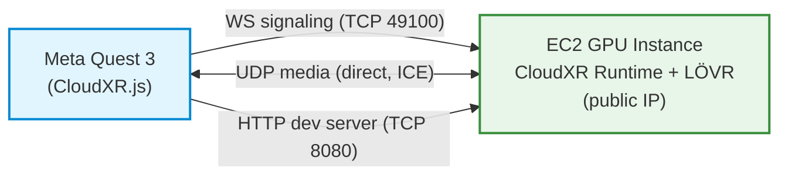

# CloudXR 6 on AWS — MVP Demo (Quest 3)



Minimal-effort instructions for proving the CloudXR streaming pipeline works: a single GPU instance streaming the LÖVR VR sample to Meta Quest 3 in immersive mode.

Uses a **pre-built AMI** with everything pre-installed — no manual driver installs, no build tools, no compilation. You launch an instance, start the web server, and connect from Quest. The published AMIs are currently shared on request (see Step 2); if you would rather not wait, build your own with the full architecture's `./ami/build-ami.sh` and use that AMI ID here — set `GPU_ZONE` and `GPU_TYPE` in `deployment/config.env` first, and run the script from the `deployment/` directory.

---

## What This Proves

- GPU renders OpenXR scene → NVENC encodes → streams over internet → Quest 3 decodes → displays in immersive VR
- Full bidirectional pipeline: video/audio downstream, head/hand tracking + controller input upstream
- Media established by ICE with a STUN server — no media address or port is supplied by the client
- Validated end-to-end on a Quest 3 with CloudXR Runtime 6.2.1 + CloudXR.js 6.2.0 + LÖVR sample v1.2.0, running on a `g7e.8xlarge` in the `us-west-2-lax-1b` Local Zone

---

## Prerequisites

- AWS account with permission to launch GPU instances (g6e or g7e family)
- Meta Quest 3 (OS 79+) on Wi-Fi (5 GHz band recommended)
- AWS CLI configured on your laptop/workstation
- ~15 minutes (instance boot + startup script initialization)

---

## Step 1: Choose Instance Location

### Option A: Local Zone (ideal, ~35-40ms pose-to-render)

Deploy in an AWS Local Zone near your physical location for the lowest latency.

```bash
# Check g7e availability in LAX Local Zone (example)
aws ec2 describe-instance-type-offerings --location-type availability-zone \
  --filters "Name=instance-type,Values=g7e.2xlarge,g7e.4xlarge,g7e.8xlarge" \
  --region us-west-2 \
  --query 'InstanceTypeOfferings[?contains(Location, `lax`)].{Type:InstanceType,Location:Location}' \
  --output table
```

Opt-in to the Local Zone if not already:
```bash
aws ec2 modify-availability-zone-group --group-name us-west-2-lax-1 --opt-in-status opted-in --region us-west-2
```

### Option B: Parent Region (fallback, ~60-70ms pose-to-render)

If no Local Zone near you has GPU capacity, deploy in the closest parent Region. Higher latency but fully functional.

---

## Step 2: Launch the Instance

Create a security group (restrict to your public IP for security):
```bash
REGION=us-west-2
MY_IP=$(curl -s https://checkip.amazonaws.com)/32
VPC_ID=$(aws ec2 describe-vpcs --filters "Name=isDefault,Values=true" --region $REGION --query 'Vpcs[0].VpcId' --output text)

SG_ID=$(aws ec2 create-security-group \
  --group-name cloudxr-mvp-demo \
  --description "CloudXR MVP demo - signaling + media + dev server" \
  --vpc-id $VPC_ID --region $REGION --query 'GroupId' --output text)

aws ec2 authorize-security-group-ingress --group-id $SG_ID --region $REGION \
  --ip-permissions \
    IpProtocol=tcp,FromPort=49100,ToPort=49100,IpRanges="[{CidrIp=$MY_IP}]" \
    IpProtocol=udp,FromPort=47998,ToPort=48012,IpRanges="[{CidrIp=$MY_IP}]" \
    IpProtocol=tcp,FromPort=8080,ToPort=8080,IpRanges="[{CidrIp=$MY_IP}]"
```

> **Note — these rules admit only the IP of the machine you ran them from.** `MY_IP` is your
> workstation's public IP, but the Quest is what actually connects. That works only if the headset
> egresses from the same public IP, which is the normal case when both are on one home or office
> network. If the headset is on guest Wi-Fi, a separate VLAN, or a phone hotspot, it has a different
> public IP and every connection will time out. Either move the headset onto the same network, or
> open the ports to its IP as well — browse to `https://checkip.amazonaws.com` in the Quest browser
> to get it, then re-run the `authorize-security-group-ingress` command above with that address as a
> `/32` in place of `$MY_IP`.

Create a subnet in the Local Zone (if you don't already have one):
```bash
# Look for an existing subnet in your target Local Zone that auto-assigns public IPs.
# The map-public-ip-on-launch filter matters: a zone can contain several subnets, and
# picking one that does not auto-assign leaves the instance with no public IP, so SSM
# never comes online and Step 3 hangs indefinitely.
SUBNET_ID=$(aws ec2 describe-subnets --region $REGION \
  --filters "Name=vpc-id,Values=$VPC_ID" "Name=availability-zone,Values=us-west-2-lax-1b" \
            "Name=map-public-ip-on-launch,Values=true" \
  --query 'Subnets[0].SubnetId' --output text)

# If no suitable subnet exists, create one
if [ "$SUBNET_ID" = "None" ] || [ -z "$SUBNET_ID" ]; then
  SUBNET_ID=$(aws ec2 create-subnet --vpc-id $VPC_ID \
    --cidr-block 172.31.100.0/24 --availability-zone us-west-2-lax-1b \
    --region $REGION --query 'Subnet.SubnetId' --output text)
  aws ec2 modify-subnet-attribute --subnet-id $SUBNET_ID --map-public-ip-on-launch --region $REGION
  echo "Created subnet: $SUBNET_ID"
else
  echo "Using existing subnet: $SUBNET_ID"
fi
```

> **Note — the CIDR above is an example:** `172.31.100.0/24` is normally free in a default VPC (whose subnets are `/20`s low in the `172.31.0.0/16` range), but `create-subnet` rejects any block that overlaps an existing subnet. If you get `InvalidSubnet.Conflict`, pick another free `/24` — list what's in use with `aws ec2 describe-subnets --filters "Name=vpc-id,Values=$VPC_ID" --query 'Subnets[].CidrBlock' --region $REGION`.

> **Note — internet connectivity for a newly created subnet:** The command above creates a subnet in your target zone but does not modify route tables. In a default VPC this is fine — new subnets are associated with the VPC's main route table, which already has a `0.0.0.0/0` route to an internet gateway, so the instance gets working internet access (required for SSM). If you're using a **non-default VPC**, or you've modified your default VPC's main route table, a newly created subnet may have **no route to the internet** — the instance will still get a public IP, but SSM will never come online and Step 3 will hang at "waiting for SSM." If that happens, confirm the subnet's route table has a `0.0.0.0/0` route pointing to an internet gateway attached to the VPC, and add one if it's missing.

Create an IAM instance profile (if you don't have one):
```bash
aws iam create-role --role-name cloudxr-mvp-demo-role \
  --assume-role-policy-document '{"Version":"2012-10-17","Statement":[{"Effect":"Allow","Principal":{"Service":"ec2.amazonaws.com"},"Action":"sts:AssumeRole"}]}'
aws iam attach-role-policy --role-name cloudxr-mvp-demo-role --policy-arn arn:aws:iam::aws:policy/AmazonSSMManagedInstanceCore
aws iam attach-role-policy --role-name cloudxr-mvp-demo-role --policy-arn arn:aws:iam::aws:policy/AmazonEC2ReadOnlyAccess
aws iam create-instance-profile --instance-profile-name cloudxr-mvp-demo-profile
aws iam add-role-to-instance-profile --instance-profile-name cloudxr-mvp-demo-profile --role-name cloudxr-mvp-demo-role
sleep 15  # Wait for IAM propagation
```

Launch the instance using a pre-built AMI:
```bash
AMI_ID="ami-0a7bcd77b90558f9c"   # the AMI for your region + GPU family (see table below)
INSTANCE_TYPE="g7e.8xlarge"      # an instance type this AMI is validated on (see table below)

INSTANCE_ID=$(aws ec2 run-instances \
  --image-id $AMI_ID \
  --instance-type $INSTANCE_TYPE \
  --subnet-id $SUBNET_ID \
  --security-group-ids $SG_ID \
  --iam-instance-profile Name=cloudxr-mvp-demo-profile \
  --block-device-mappings 'DeviceName=/dev/sda1,Ebs={VolumeSize=200,VolumeType=gp3}' \
  --metadata-options 'HttpEndpoint=enabled,HttpTokens=required' \
  --tag-specifications 'ResourceType=instance,Tags=[{Key=Name,Value=CloudXR-MVP-Demo},{Key=Pool,Value=webrtc}]' \
  --region $REGION \
  --query 'Instances[0].InstanceId' --output text)

echo "Instance: $INSTANCE_ID"
aws ec2 wait instance-running --instance-ids $INSTANCE_ID --region $REGION
```

> **Pre-built AMIs (g7e, 1 GPU):**
> | Region | AMI ID |
> |--------|--------|
> | us-west-2 | `ami-0a7bcd77b90558f9c` |
> | us-west-1 | N/A |
> | us-east-1 | `ami-02cd308eb6b345a3e` |
> | us-east-2 | `ami-0c21f6322c87839fb` |
>
> The values above are already filled into the commands — `ami-0a7bcd77b90558f9c` with `INSTANCE_TYPE=g7e.8xlarge`, matching the `us-west-2-lax-1b` zone used throughout this guide. If you deploy elsewhere, swap in the AMI for that region. `us-west-1` is `N/A` because the region offers no g7e or g6e instances.
>
> This AMI is validated on `g7e.8xlarge`. AMIs are GPU-hardware-specific and portability across instance sizes is not guaranteed — the [full architecture guide's AMI table](../deployment/full-architecture-deployment-guide.md#step-1-build-the-golden-ami) is the canonical list, which also carries the g6e 1-GPU variant.
>
> **Note:** These AMIs are currently private. To request access, email laroue@amazon.com with your AWS account ID. Alternatively, build your own AMI using the full architecture's `./ami/build-ami.sh` script — build it on the instance type you intend to run.

---

## Step 3: Wait for Boot + Get Public IP

The startup script takes ~5-7 minutes on first boot (AWS PowerShell module cold import). Wait for SSM to come online, then get the public IP:

```bash
echo "Waiting for SSM (~5-7 min on first boot)..."
while true; do
  STATUS=$(aws ssm describe-instance-information \
    --filters "Key=InstanceIds,Values=$INSTANCE_ID" \
    --region $REGION --query 'InstanceInformationList[0].PingStatus' --output text 2>/dev/null)
  [ "$STATUS" = "Online" ] && break
  sleep 15
done
echo "SSM online."

PUBLIC_IP=$(aws ec2 describe-instances --instance-ids $INSTANCE_ID --region $REGION \
  --query 'Reservations[0].Instances[0].PublicIpAddress' --output text)
echo "Public IP: $PUBLIC_IP"
```

---

## Step 4: Verify CloudXR is Running

Verify lovr.exe is running and port 49100 is listening:

```bash
CMD_ID=$(aws ssm send-command --instance-ids $INSTANCE_ID \
  --document-name AWS-RunPowerShellScript \
  --parameters '{"commands":["Get-Process lovr -ErrorAction SilentlyContinue | Select ProcessName,Id","netstat -an | Select-String 49100"]}' \
  --region $REGION --query 'Command.CommandId' --output text)

sleep 15
aws ssm get-command-invocation --command-id $CMD_ID --instance-id $INSTANCE_ID \
  --region $REGION --query 'StandardOutputContent' --output text
```

**Expect empty output on the first try.** SSM comes online well before the startup script finishes — on a first boot the script's `Import-Module AWSPowerShell` alone takes about **4 minutes**, and lovr is only launched after it. Empty output means "not there yet," not "broken." Poll until the port is listening:

```bash
until aws ssm send-command --instance-ids $INSTANCE_ID \
  --document-name AWS-RunPowerShellScript \
  --parameters '{"commands":["if (Get-NetTCPConnection -LocalPort 49100 -State Listen -ErrorAction SilentlyContinue) { Write-Host LISTENING } else { Write-Host waiting }"]}' \
  --region $REGION --query 'Command.CommandId' --output text > /tmp/cid && sleep 12 && \
  aws ssm get-command-invocation --command-id $(cat /tmp/cid) --instance-id $INSTANCE_ID \
    --region $REGION --query 'StandardOutputContent' --output text | grep -q LISTENING
do echo "  startup script still running..."; sleep 15; done
echo "lovr is up and port 49100 is listening."
```

To watch progress directly, tail the startup log:
```bash
CMD_ID=$(aws ssm send-command --instance-ids $INSTANCE_ID \
  --document-name AWS-RunPowerShellScript \
  --parameters '{"commands":["Get-Content C:\\cxr-logs\\startup.log -Tail 15"]}' \
  --region $REGION --query 'Command.CommandId' --output text)
sleep 15
aws ssm get-command-invocation --command-id $CMD_ID --instance-id $INSTANCE_ID \
  --region $REGION --query 'StandardOutputContent' --output text
```

> **Note — expected warning in `startup.log`:** The startup script is shared with the full architecture, where instances register themselves in a DynamoDB registry. The MVP deploys no registry table, and its IAM role has no DynamoDB permissions, so you will see:
>
> ```
> WARNING: DynamoDB registration failed - this instance will NOT be routable by the proxy.
>   Expected in the MVP topology, which has no registry table.
> ```
>
> **This is expected here and does not affect streaming.** Registration is optional and is the last thing the script does — the ICE/STUN configuration and the `lovr.exe` launch both complete before it. The log should still end with `Startup complete.` Confirm `lovr.exe` is running and port 49100 is listening and you are good to go. (In the full architecture this warning would matter: it means the proxy cannot route to the instance. There, it points at a missing `dynamodb:PutItem` permission on the GPU instance role.)

---

## Step 5: Reboot for Clean Runtime State

The initial boot's startup script activity can leave the runtime in a state where the first connection fails. Reboot to ensure a clean state:

```bash
aws ssm send-command --instance-ids $INSTANCE_ID \
  --document-name AWS-RunPowerShellScript \
  --parameters '{"commands":["Restart-Computer -Force"]}' \
  --region $REGION --timeout-seconds 30
```

The reboot is much faster than the first boot — the AWS PowerShell module is already cached, so it loads in well under a minute instead of ~4 minutes. Wait for SSM, then poll for the port:

```bash
sleep 60  # let the instance actually go down before polling

while true; do
  STATUS=$(aws ssm describe-instance-information \
    --filters "Key=InstanceIds,Values=$INSTANCE_ID" \
    --region $REGION --query 'InstanceInformationList[0].PingStatus' --output text 2>/dev/null)
  [ "$STATUS" = "Online" ] && break
  sleep 15
done
echo "SSM online after reboot."

until aws ssm send-command --instance-ids $INSTANCE_ID \
  --document-name AWS-RunPowerShellScript \
  --parameters '{"commands":["if (Get-NetTCPConnection -LocalPort 49100 -State Listen -ErrorAction SilentlyContinue) { Write-Host LISTENING } else { Write-Host waiting }"]}' \
  --region $REGION --query 'Command.CommandId' --output text > /tmp/cid && sleep 12 && \
  aws ssm get-command-invocation --command-id $(cat /tmp/cid) --instance-id $INSTANCE_ID \
    --region $REGION --query 'StandardOutputContent' --output text | grep -q LISTENING
do echo "  waiting for runtime..."; sleep 10; done
echo "Port 49100 listening. Ready."
```

The startup log should show `ICE + STUN configuration already present in cloudxr_manager.lua` on this second run — the configuration is applied once and is idempotent thereafter.

---

## Step 6: Start the CloudXR.js Dev Server

The pre-built AMI includes the CloudXR.js React sample, but the HTTP dev server is not started automatically. First, open the Windows Firewall for port 8080 (not included in the AMI's default rules), then start the server:

```bash
CMD_ID=$(aws ssm send-command --instance-ids $INSTANCE_ID \
  --document-name AWS-RunPowerShellScript \
  --parameters commands='["netsh advfirewall firewall add rule name=\"CloudXR.js Dev Server\" dir=in action=allow protocol=TCP localport=8080","Set-Content -Path C:\\start-devserver.bat -Value \"@echo off`r`ncd /d C:\\lovr\\build\\cloudxr\\cloudxr-js-samples\\react`r`nset PATH=%PATH%;C:\\Program Files\\nodejs`r`nnpm run dev-server\"","Start-Process -FilePath C:\\start-devserver.bat -WindowStyle Hidden","Start-Sleep 10","netstat -an | findstr 8080"]' \
  --region $REGION --timeout-seconds 60 \
  --query 'Command.CommandId' --output text)

sleep 60
aws ssm get-command-invocation --command-id $CMD_ID --instance-id $INSTANCE_ID \
  --region $REGION --query 'StandardOutputContent' --output text
```

The `netstat` output at the end of that command will usually still be **empty** — the webpack dev server takes roughly **2-3 minutes** to compile on first start, longer than the command waits. That is expected. Poll until it is listening:

```bash
until aws ssm send-command --instance-ids $INSTANCE_ID \
  --document-name AWS-RunPowerShellScript \
  --parameters '{"commands":["if (Get-NetTCPConnection -LocalPort 8080 -State Listen -ErrorAction SilentlyContinue) { Write-Host LISTENING } else { Write-Host waiting }"]}' \
  --region $REGION --query 'Command.CommandId' --output text > /tmp/cid && sleep 12 && \
  aws ssm get-command-invocation --command-id $(cat /tmp/cid) --instance-id $INSTANCE_ID \
    --region $REGION --query 'StandardOutputContent' --output text | grep -q LISTENING
do echo "  dev server still compiling..."; sleep 10; done
echo "Dev server listening on 8080."
```

Then confirm it serves from your machine (the security group allows only your IP):
```bash
curl -sS -o /dev/null -w "HTTP %{http_code}\n" --max-time 60 http://$PUBLIC_IP:8080/
```

The **first** request may time out while webpack finishes compiling on demand; retry once and it will return `200`.

---

## Step 7: Connect from Quest 3

### One-time browser setup

1. Open Quest browser → navigate to `chrome://flags`
2. Search for `unsafely-treat-insecure-origin-as-secure`
3. **Enable** the flag and add: `http://<PUBLIC_IP>:8080`
4. Relaunch the browser

### Connect

1. Navigate to `http://<PUBLIC_IP>:8080/`
2. Confirm the connection settings:
   - **Select Server Backend:** `Manual Input IP:Port` (already selected — the only enabled option)
   - **Server IP:** `<PUBLIC_IP>` (the field defaults to the page's hostname, so it is already correct)
   - **Port:** `49100` (already the default)
   - **Media Address:** leave blank
   - **Media Port:** leave blank
3. Change **Immersive Mode** to **VR Immersive**. This is the **only field you must actually change** — it defaults to *AR Immersive*.
4. Press **Connect**
5. Grant VR permission when prompted

> **Optional:** **Load defaults** defaults to `Custom`; selecting `Quest 3` applies that headset's tuned resolution and frame-rate defaults. Not required — the stock `Custom` values stream fine on g7e. **Video Codec** defaults to `AV1`, which is correct for g7e (Blackwell) and g6e (Ada). Only drop to `H.264` on older GPUs (see the g4dn/g5 settings below).

> **Note — media address is intentionally blank:** The instance runs with ICE enabled and a STUN server configured (see the [architecture design document](../architecture/architecture.md)), so the media path is negotiated automatically. Leave both media fields empty.

> **Note — first connections after boot:** On a freshly booted instance, the first one or two attempts may fail outright, or connect but stream at reduced quality. The first attempt can also take noticeably longer to reach "connected" — around 30 seconds has been observed, versus near-instant afterward — so give it time before assuming it has hung. Disconnect and reconnect until the stream is smooth; typically the second attempt is clean. This affects first use after boot only, does not recur for the life of the instance, and is under investigation.

### What you should see

- Immersive VR environment (LÖVR sample scene)
- Hands tracked with blue cube visualizations at each joint
- Floating UI panel with performance metrics (render FPS, streaming FPS, pose-to-render latency)
- Action buttons triggering floating text updates (opaque data channel)

---

## Expected Performance

| Instance | GPU | Location | Typical Pose-to-Render |
|----------|-----|----------|----------------------|
| g7e (any size) | RTX PRO 6000 (Blackwell) | Local Zone | ~35-40 ms |
| g6e (any size) | L40S (Ada) | Local Zone | ~40-50 ms |
| g7e / g6e | Same | Parent Region (nearby) | ~60-70 ms |
| g4dn / g5 | T4 / A10G | Local Zone | ~55-65 ms (optimized settings) |

**g4dn / g5 optimized settings** (set in the React sample UI before connecting):
- Per-Eye Width: `1792`, Per-Eye Height: `1792`
- Video Codec: `H264`
- Device Frame Rate: `72`

---

## Troubleshooting

| Symptom | Cause | Fix |
|---------|-------|-----|
| lovr.exe not running | Startup script failed before launching it — most often `Import-Module AWSPowerShell` failing, which aborts the script | Check `C:\cxr-logs\startup.log` for the first `ERROR:` line. Ensure the instance has an IAM role with `AmazonSSMManagedInstanceCore` + `AmazonEC2ReadOnlyAccess`, then reboot. (A missing `Pool` tag is *not* a cause — the script defaults to `webrtc`.) |
| `WARNING: DynamoDB registration failed` in `startup.log` | The startup script is shared with the full architecture and registers instances in a DynamoDB registry, which the MVP does not deploy | **Expected — ignore it.** Registration is optional and is the script's last step; ICE/STUN config and the `lovr.exe` launch happen before it. The log should still reach `Startup complete.` Verify `lovr.exe` is running and port 49100 is listening. |
| Empty output when checking for lovr / port 49100 | SSM comes online before the startup script finishes (first-boot `Import-Module AWSPowerShell` takes ~4 min) | Not a failure. Poll until port 49100 listens (see Step 4) |
| Port 49100 not listening | lovr.exe not running or runtime still initializing | Wait 30s after lovr starts. If still not listening, reboot. |
| Port 8080 not listening | Dev server not started | Run Step 6 |
| Quest shows "WebXR not supported" | Insecure-origin flag not configured | Redo Step 7 browser setup |
| First attempt errors ("server validation timeout"), takes ~30s to reach "connected", or connects but streams poorly | Warm-up on a freshly booted instance (under investigation) | Expected on first use after boot. Give the first attempt time, then disconnect and reconnect until smooth — typically the second attempt is clean, and it stays stable for the life of the instance. |
| "No response from media server" (0xC0F22226) | Media UDP blocked, or STUN unreachable | Verify security group allows UDP 47998-48012 from your IP, and that the instance has outbound internet access to reach the STUN endpoint |
| IPv6 address parsing warnings in runtime logs | CloudXR Runtime does not support IPv6; dual-stack client networks advertise IPv6 candidates | Non-consequential. ICE completes on an IPv4 candidate pair and streaming proceeds normally. |
| Signaling timeout (0xC0F22213) | TCP port 49100 blocked | Verify security group allows TCP 49100 from your IP |
| Everything times out from the headset, but `curl http://$PUBLIC_IP:8080/` works from your laptop | The headset is on a different public IP than the one in the security group (guest Wi-Fi, separate VLAN, phone hotspot) — the Step 2 rules only admit your workstation's IP | Browse to `https://checkip.amazonaws.com` in the Quest browser and compare it to `MY_IP`. If they differ, either move the headset onto the same network or add its `/32` to the security group for TCP 49100, UDP 47998-48012 and TCP 8080 |
| Pose-to-render 800ms+ (g7e only) | GPU clocks not boosted | The startup script runs `nvidia-smi -lgc 2000,2520` automatically. If still slow, run it manually via SSM. |
| SSM not connecting | First-boot timing in Local Zone | Wait 5-7 minutes, or reboot the instance |

---

## Tear Down

GPU instances are expensive — tear down as soon as you're done. Run these in order; the security
group cannot be deleted until the instance has fully released its network interface.

**If you're in a new terminal**, the shell variables from Step 2 are gone. Re-derive them by
looking up the resources by name — this works regardless of when you come back:

```bash
REGION=us-west-2

INSTANCE_ID=$(aws ec2 describe-instances --region $REGION \
  --filters "Name=tag:Name,Values=CloudXR-MVP-Demo" \
            "Name=instance-state-name,Values=running,stopped,stopping" \
  --query 'Reservations[0].Instances[0].InstanceId' --output text)

SG_ID=$(aws ec2 describe-security-groups --region $REGION \
  --filters "Name=group-name,Values=cloudxr-mvp-demo" \
  --query 'SecurityGroups[0].GroupId' --output text)

echo "Instance: $INSTANCE_ID"
echo "Security group: $SG_ID"
```

Confirm both printed real IDs (not `None`) before continuing.

```bash
# 1. Terminate the instance and wait for it to release its ENI
aws ec2 terminate-instances --instance-ids $INSTANCE_ID --region $REGION
aws ec2 wait instance-terminated --instance-ids $INSTANCE_ID --region $REGION
echo "Instance terminated."

# 2. Delete the security group (retry — ENI detachment can lag termination)
for i in 1 2 3 4 5 6; do
  aws ec2 delete-security-group --group-id $SG_ID --region $REGION 2>/dev/null && { echo "Security group deleted."; break; }
  echo "  waiting for ENI release..."; sleep 10
done

# 3. Delete the IAM instance profile and role
aws iam remove-role-from-instance-profile \
  --instance-profile-name cloudxr-mvp-demo-profile --role-name cloudxr-mvp-demo-role
aws iam delete-instance-profile --instance-profile-name cloudxr-mvp-demo-profile
aws iam detach-role-policy --role-name cloudxr-mvp-demo-role \
  --policy-arn arn:aws:iam::aws:policy/AmazonSSMManagedInstanceCore
aws iam detach-role-policy --role-name cloudxr-mvp-demo-role \
  --policy-arn arn:aws:iam::aws:policy/AmazonEC2ReadOnlyAccess
aws iam delete-role --role-name cloudxr-mvp-demo-role
echo "IAM role and profile deleted."
```

Verify nothing is left running:
```bash
aws ec2 describe-instances --region $REGION \
  --filters "Name=instance-state-name,Values=running,stopped,pending,stopping" \
  --query 'Reservations[].Instances[].{Id:InstanceId,Type:InstanceType}' --output table

# Terminated instances delete their root volume automatically, but confirm none were orphaned
aws ec2 describe-volumes --region $REGION --filters "Name=status,Values=available" \
  --query 'Volumes[].{Id:VolumeId,Size:Size}' --output table
```

**Deliberately not deleted:**

| Resource | Why |
|---|---|
| The subnet | Only delete it if **you** created it in Step 2 (the script prints "Created subnet"). If it printed "Using existing subnet", it predates this demo — leave it alone. To remove one you created: `aws ec2 delete-subnet --subnet-id $SUBNET_ID --region $REGION` |
| The AMI and its snapshot | Reusable for future runs. Deregister with `aws ec2 deregister-image --image-id $AMI_ID --region $REGION` then `aws ec2 delete-snapshot --snapshot-id <snap-id> --region $REGION`, but only if you built it yourself and no longer want it |
| The Quest browser flag | Harmless, but you can remove the `unsafely-treat-insecure-origin-as-secure` entry in `chrome://flags` since the IP is now dead |

---

## What's Next

This MVP demo proves the streaming pipeline works with a direct connection (no proxy, no auth, no CDN). For a production deployment with:
- HTTPS + authentication (Cognito)
- Automatic instance routing (proxy + DynamoDB registry)
- Global CDN for the web client (CloudFront + S3)
- Auto-scaling GPU fleet

See the [Full Architecture Deployment Guide](../deployment/full-architecture-deployment-guide.md).

Note that the full architecture authenticates both the session API and the signaling
upgrade against Cognito, and restricts its load balancer to CloudFront. This MVP has
neither — it is deliberately bare, and its only protection is the security group
restricting every port to your own IP. Do not leave it running.
